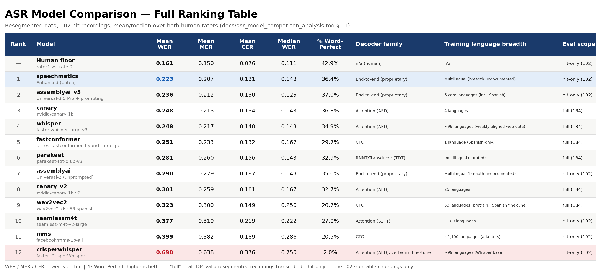

# Twelve ASR Models, One Question: Which One Actually Hears What a Language Learner Said?

*Image credits: Google Summer of Code and HumanAI*

**Project:** AutoEIT — Automatic Speech Recognition for L2 Spanish Elicited Imitation
**Organization:** [HumanAI Foundation](https://humanai.foundation/)
**Contributor:** Mykyta Hrebeniuk
**Mentor:** Mandy Faretta-Stutenberg
**Program:** Google Summer of Code 2026, coding period May 25 – August 16
**Code:** [github.com/humanai-foundation/AutoEIT](https://github.com/humanai-foundation/AutoEIT)

---

## Project description

[Link to the official GSoC project page here.]

If you want to know how good a second-language learner's Spanish is, one well-established way to
find out is an **Elicited Imitation Test (EIT)**: play a learner a sentence, ask them to repeat it
back, and see how closely their repetition matches the original. The harder the sentence and the
more accurately (or fluently) a learner can reproduce it, the more it reveals about their
underlying grammar. It's a clever test — but scoring it at scale means transcribing thousands of
short, often disfluent, accented recordings, and doing that by hand doesn't scale past a
university lab.

AutoEIT's goal this summer was to automate the transcription half of that pipeline for L2 Spanish
learners, and — more importantly — to find out whether any automated transcription could actually
be *trusted* to feed a proficiency score. The downstream scoring step itself (turning a transcript
into a number) is a separate component built by another student on the project; my job was
everything upstream of that: segmenting raw recordings into per-sentence clips, transcribing them,
and rigorously comparing candidate ASR systems against independent human transcriptions so that
whichever backend eventually gets used, the choice rests on evidence instead of assumption.

That last part — Goal 3 — ended up being the largest and most interesting piece of the project,
and it splits into two questions that turn out **not** to be the same question: which model is most
*accurate*, and which model is most *faithful* to what the learner actually said. A model can be
excellent at one and mediocre at the other, and by the end of the summer that distinction was the
single biggest lesson of the whole project.

## 1. The problem with the audio

Raw recordings are one WMA/MP3 file per test session, containing 30+ separate spoken responses
back to back, with no built-in markers for where one response ends and the next begins. Step one
was carving each file into clean, per-sentence clips using Silero VAD (voice activity detection).
The first pass segmented the *entire* file — including several minutes of English instructions and
practice items at the start — merging speech chunks whenever the gap between them was under 2.5
seconds.

That worked, but only about 46% of recordings landed on *exactly* 30 detected items — the number
needed to align automatic transcripts against human ones purely by position. So I built a second
pass that first located where the English instructions ended and the Spanish target sentences
began (by keyword-matching two known reference sentences), then re-segmented just that narrower
window with a longer, 4-second merge-gap threshold. That single change raised the "hit rate" to
55%, at a small cost in over-merging a handful of longer items — a real, if imperfect, improvement,
and the segmentation used for essentially everything described below.

## 2. Building a twelve-model comparison harness

Starting from a single baseline — `faster-whisper` large-v3 — I built a shared transcription
harness (one script per model, sharing item-discovery logic) and, over the course of the summer,
ran **twelve ASR systems** against the same segmentation, each scored against **two independent
human raters**' transcriptions of the same audio:

- **Open-source, attention decoder:** Whisper large-v3, NVIDIA Canary-1B and Canary-1B-v2,
  SeamlessM4T v2, CrisperWhisper (a verbatim-focused Whisper fine-tune)
- **Open-source, CTC:** Wav2Vec2-XLSR-Spanish, Meta MMS, a Spanish-only FastConformer
- **Open-source, RNNT/transducer:** NVIDIA Parakeet-TDT
- **Commercial API:** AssemblyAI (Universal-2), a differently-prompted AssemblyAI Universal-3.5 Pro
  call, and Speechmatics (Enhanced)

Each addition was a direct response to the previous one's result, not a random walk — for example,
CrisperWhisper's fine-tuned "verbatim" objective underperformed badly (more on that below), which is
exactly what motivated testing whether an *architectural* route to verbatim preservation —
FastConformer's CTC head, Canary's non-Whisper decoder — would do better. It did.

## 3. Why WER alone isn't enough

Every model is scored on three related metrics — **WER**, **MER**, and **CER** — against both human
raters independently. WER (word error rate) is the standard metric in this literature, but it's
unbounded above 1.0: a hallucinated, insertion-heavy transcript can rack up more errors than the
reference has words. MER bounds the same edit-distance calculation into [0, 1], so a handful of
catastrophic outliers can't single-handedly drag a model's mean around. CER — the same idea over
characters instead of words — matters specifically for Spanish, where a near-miss like *"tiene"* vs.
*"tienen"* costs a full word under WER but only a couple of characters under CER.

Before trusting any of these numbers, though, I measured something more basic: how much do two
careful *human* transcribers, listening to the same recording, disagree with each other? The answer
— a mean WER of **0.161** — sets a realistic floor. No ASR system should be expected to beat that,
because that's the rate at which two trained humans naturally hear disfluent, accented speech
differently. It also means that the roughly 0.25 WER gap ASR systems were showing wasn't mostly
ground-truth noise: about 40% of it is real, fixable ASR error.

## 4. The headline result

Twelve systems in, ranked by mean WER on the 102-recording set where automatic segmentation lines
up reliably with the human transcripts:

| Rank | Model | WER | MER | CER | % perfect |
| --- | --- | --- | --- | --- | --- |
| — | **Human floor** | 0.161 | 0.150 | 0.076 | 42.9% |
| 1 | `speechmatics` (Enhanced) | **0.223** | 0.207 | 0.131 | 36.4% |
| 2 | `assemblyai_v3` (Universal-3.5 Pro + prompting) | 0.236 | 0.212 | **0.130** | **37.0%** |
| 3 | `canary` (nvidia/canary-1b) | 0.248 | 0.213 | 0.134 | 36.8% |
| 4 | `whisper` (faster-whisper large-v3) | 0.248 | 0.217 | 0.140 | 34.9% |
| 7 | `assemblyai` (Universal-2, unprompted) | 0.290 | 0.279 | 0.187 | 35.0% |
| 12 | `crisperwhisper` | 0.690 | 0.638 | 0.376 | 2.0% |

A plain, unprompted commercial API call (AssemblyAI's Universal-2) loses to the free, open-source
Whisper baseline on every metric. Two systems added later — Speechmatics and a differently-prompted
AssemblyAI call — are the first candidates in twelve tries to clearly beat the long-standing
`whisper`/`canary` plateau. That's a real, if modest, result: after nine straight open-source
candidates converged around 0.25 WER, a model swap finally has a measurable accuracy case behind
it.

## 5. Even the best models are wrong in interesting ways

Neither `speechmatics` nor `canary` — the two systems this project actually recommends — is
anywhere near perfect. Speechmatics produced *no output at all* on one quiet clip, and on another
returned a completely unrelated but fluent sentence ("Es saludable para Carmen.") for a stimulus
about a book on a table. Canary, given the same "empty audio" style clip, muttered "mm"; on another
item, it substituted an entirely different, grammatically fine sentence about someone always being
hungry. Both failure patterns — silence-on-hard-audio, and confidently substituting an unrelated
fluent sentence — showed up across weaker models too, just more often.

The most dramatic single illustration of that second pattern came from a same-input comparison: fed
the identical clip of *"El se ducha cada mañana"* ("He showers every morning"), Meta's MMS (a CTC
model, no language-model prior) produced **"ela seduta cara manhana"** — nonsense, but still
phonetically tethered to the actual audio. SeamlessM4T, an attention-based model, produced **"el
jefe de la policía"** — "the chief of police" — a fluent, grammatical sentence with zero relation
to what was actually said. Same clip, opposite failure modes, and a clean illustration of the
CTC-vs-attention-decoder distinction that recurred throughout the summer.

## 6. The CrisperWhisper cautionary tale

`CrisperWhisper` — a Whisper fine-tune trained specifically to *preserve* disfluencies rather than
smooth them away — looked, on paper, like the most direct test of this whole project's hypothesis.
It turned out to be the worst model tried, by a wide margin (WER 0.690, more than double the
next-worst system). Two real bugs made it look even worse than it actually was: a copied
`temperature=0` setting silently disabled `faster-whisper`'s automatic retry-on-repetition safety
net, causing 14.89% of a test batch to collapse into loops like *"Me me me me me…"* repeated 111
times; and a tokenizer artifact marked word boundaries with a stray comma instead of a space. Both
were found and fixed. Even after fixing both, CrisperWhisper still underperformed badly — the
deeper reason turned out to be that the two human raters themselves transcribe fairly cleaned-up
text, so a model trained to be *more* verbatim than the actual scoring reference was optimizing for
the wrong target. That result is exactly what motivated testing an *architectural* route to
verbatim preservation instead (FastConformer's CTC head, Canary's decoder) — which worked far
better.

## 7. The most interesting finding: does ASR quietly "correct" learners?

Aggregate WER can't distinguish two very different situations: a model heard the learner say
something close to the script, or a model silently smoothed a genuine deviation back toward the
scripted sentence because its own internal language model found the "correct" version more
plausible. For an Elicited Imitation Test specifically, that second case isn't a minor scoring
nuisance — a learner's deviations from the script *are* the signal the test exists to measure. A
model that quietly "corrects" them doesn't just add noise; it systematically makes a learner look
more accurate than they actually were.

I built a dedicated check for this: restricting to the ~2,200 items where **both** independent
human raters heard the learner deviate from the script, how often does a model's output land back
on the *exact* scripted sentence anyway? A concrete example, stimulus *"El libro está en la mesa"*:
both human raters independently transcribed the same gender-agreement slip, *"el mesa"* — but
`whisper` and `assemblyai_v3` both silently output the grammatically-correct *"la mesa"* instead.

Across the full comparison, `whisper` and `assemblyai_v3` — two of the most *accurate* models by raw
WER — turned out to be the two most likely of all twelve to do exactly this, clearing even the
human-to-human noise floor for this behavior. `speechmatics` and `canary` did not: they sit at or
below that floor, no more prone to silently "correcting" a learner than two independent humans are
to coincidentally agreeing with each other. That's the reason this project's final recommendation
is `speechmatics` and `canary`, not the raw-accuracy leader `assemblyai_v3` — for a test whose whole
point is capturing genuine learner deviations, faithfulness has to be weighed alongside accuracy,
not assumed to follow from it.

## Code and further reading

- Code: [github.com/humanai-foundation/AutoEIT](https://github.com/humanai-foundation/AutoEIT)
- Full GSoC final report: [`docs/GSOC_FINAL_REPORT.md`](https://github.com/humanai-foundation/AutoEIT/blob/main/docs/GSOC_FINAL_REPORT.md)
- Detailed technical writeup (full ranking table, a section per model, every cross-cutting analysis):
  [`docs/asr_model_comparison_analysis.md`](https://github.com/humanai-foundation/AutoEIT/blob/main/docs/asr_model_comparison_analysis.md)
- Bugs found along the way, and a train/val/test-split methodology correction:
  [Challenges and lessons learned](https://github.com/humanai-foundation/AutoEIT/blob/main/docs/GSOC_FINAL_REPORT.md#6-challenges-and-lessons-learned)
- What's left to do: [`docs/GSOC_FINAL_REPORT.md` §4](https://github.com/humanai-foundation/AutoEIT/blob/main/docs/GSOC_FINAL_REPORT.md#4-whats-left-to-do)

## Acknowledgments

Thanks to my mentor, Mandy Faretta-Stutenberg, for her guidance throughout the summer, and to
Michael McGuire, who shared valuable insight from his own EIT research and platform in a
conversation early in the project.

## References

McGuire, M. (2025). *Automatic Speech Recognition for Non-Native English: Accuracy and Disfluency
Handling*. arXiv:2503.06924. [https://arxiv.org/abs/2503.06924](https://arxiv.org/abs/2503.06924)
