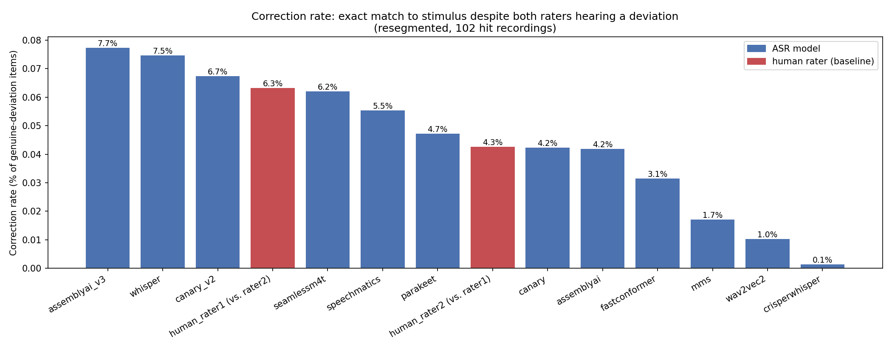
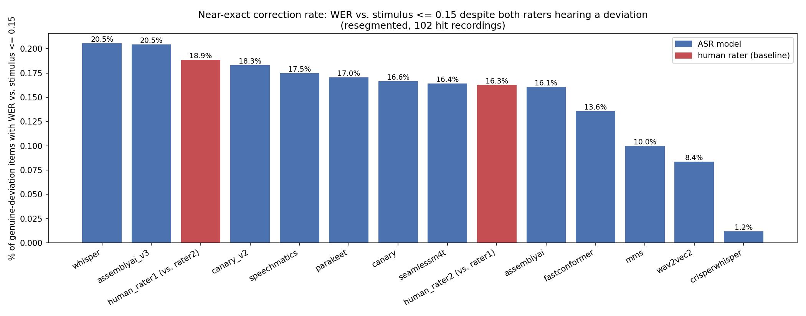
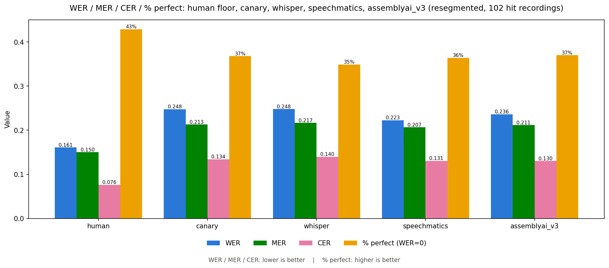

# GSoC 2026 Final Work Product

**Organization:** [HumanAI](https://humanai.foundation/)

**Project:** AutoEIT — Audio-to-text transcription for second/additional language learner data

**Contributor:** Mykyta Hrebeniuk

**Mentors:** Mandy Faretta-Stutenberg

**Program dates:** Coding period May 25 – August 24, 2026

**Repository:** [github.com/humanai-foundation/AutoEIT](https://github.com/humanai-foundation/AutoEIT) — this project lives in [`AutoEIT_Audio-to-text_transcription_for_second_additional_language_learner_data_Mykyta_Hrebeniuk/`](https://github.com/humanai-foundation/AutoEIT/tree/main/AutoEIT_Audio-to-text_transcription_for_second_additional_language_learner_data_Mykyta_Hrebeniuk)

---

## 1. Project goals

AutoEIT administers an **Elicited Imitation Test (EIT)** to L2 (second-language) Spanish learners: a learner hears a Spanish sentence and repeats it back, and an automated proficiency score is derived from how closely a transcript of that repetition matches the original sentence. That scoring step is a separate component, built by another student on the project, and is out of scope here. Turning the ASR side of that pipeline into something scalable requires transcribing thousands of short, often disfluent, accented recordings automatically — and, since the proficiency score downstream depends entirely on transcript accuracy, verifying that the automated transcription is actually trustworthy in the first place.

My project was to build and evaluate the ASR (automatic speech recognition) side of that pipeline, end to end:

1. **Segment** raw multi-item recordings (one WMA/MP3 file containing 30+ spoken responses) into per-sentence audio clips.
2. **Transcribe** those clips with one or more ASR systems.
3. **Evaluate** candidate ASR systems rigorously against independent human-rater transcriptions, so this pipeline's choice of backend rests on measured accuracy rather than assumption.

Goal 3 turned out to be the largest and most valuable part of the project, and it split into two distinct questions rather than one. Prior work on ASR evaluation for language-learner speech — specifically McGuire's paper [*"Automatic Speech Recognition for Non-Native English: Accuracy and Disfluency Handling"*](https://arxiv.org/abs/2503.06924), which informed this project's choice of evaluation metrics (§2.3) — argues that raw transcription accuracy and disfluency-handling need to be evaluated as separate concerns, since a model can look accurate in aggregate while still systematically smoothing away the disfluencies that make a learner's response diagnostic in the first place. That framing shaped this project's central question directly: which ASR system is both the **most accurate** and the **most faithful to what a learner actually said**, on this project's own Spanish EIT data — since no existing evaluation had measured either question for Spanish specifically before this summer.

---

## 2. What I did

### 2.1 Preprocessing: VAD-based segmentation

Built a Silero-VAD-based segmentation pipeline (`src/preprocessing/`) that splits each raw recording into per-item clips, since the transcription stage needs one sentence per audio file (Whisper's word timestamps degrade on long audio, and per-item files avoid manual sentence-matching downstream).

- **`v1`** (`data/segmented/v1/`): whole-file segmentation, 2.5s VAD merge-gap threshold. This ran across the full ~206-recording dataset on Metis, the project's HPC cluster, via a PBS batch job.
- **`v2`** (`data/segmented/v2/`): after localizing each recording's English-instructions-end and Spanish-target-sentence-end via stimulus-sentence matching, re-segmented *just* that window with a 4s merge-gap threshold. This raised the rate of recordings landing on exactly 30 detected items (a "hit" — the count needed for reliable position-based alignment against human transcripts) from 45.7% to 55.4% (102 of 184 valid recordings, up from 84).

### 2.2 A twelve-model transcription and evaluation harness

Starting from a single baseline (`faster-whisper` large-v3), I built out a shared harness (`src/transcription/transcribe_resegmented_*.py`, one script per model, sharing item-discovery logic via `src/transcription/resegmented_items.py`) and ran **twelve ASR systems** against the same `v2` segmentation, each scored against **two independent human raters'** transcriptions:

| Family | Models |
| --- | --- |
| Open-source, attention decoder | `whisper` (faster-whisper large-v3), `canary` (nvidia/canary-1b), `canary_v2`, `seamlessm4t` (facebook/seamless-m4t-v2-large), `crisperwhisper` (verbatim fine-tune) |
| Open-source, CTC | `wav2vec2` (xlsr-53-spanish), `mms` (facebook/mms-1b-all), `fastconformer` (Spanish-only, decoded via its CTC head) |
| Open-source, RNNT/transducer | `parakeet` (nvidia/parakeet-tdt-0.6b-v3) |
| Commercial API | `assemblyai` (Universal-2), `assemblyai_v3` (Universal-3.5 Pro + disfluency-preserving prompting), `speechmatics` (Enhanced) |

Each addition was motivated by the previous one's result, not tried at random — see `docs/asr_model_comparison_analysis.md` §3 for the full per-model reasoning chain (e.g., CrisperWhisper's fine-tuned verbatim objective underperformed, which motivated testing whether an *architectural* route to verbatim preservation — FastConformer's CTC head, Canary's non-Whisper decoder — would do better; it did).

### 2.3 Why WER, MER, and CER

Every model in this comparison is scored on three related but distinct metrics, computed via [`jiwer`](https://github.com/jitsi/jiwer) after lowercasing and stripping punctuation, against **both** human raters independently:

- **WER (Word Error Rate)** = (Substitutions + Deletions + Insertions) / N, where N is the reference word count. This is the standard metric in the ASR-for-language-learners literature — including [McGuire's paper](https://arxiv.org/abs/2503.06924), which uses it directly for scoring English EIT responses — so using it here keeps this project's Spanish results comparable to that prior work rather than introducing an incomparable metric. Its one weakness: WER is **unbounded above 1.0**, since a hallucinated, insertion-heavy hypothesis can rack up more errors than the reference has words at all — which matters directly for this project, since several models (§2.6, §2.7) do exactly that on their worst clips.
- **MER (Match Error Rate)** = (S + D + I) / (S + D + C + I), the same edit operations as WER but with a bounded denominator, so it's always in [0, 1]. This was added specifically to keep a small number of catastrophic outliers (an insertion-heavy hallucinated clip) from single-handedly dragging a model's *mean* WER around — MER stays interpretable even when WER doesn't.
- **CER (Character Error Rate)** — the same edit-distance idea, computed over characters instead of words. This is particularly relevant for Spanish specifically: Spanish is more morphologically inflected than English (verb conjugations, gender/number agreement), so a near-miss error like "tiene" vs. "tienen" costs a full word under WER but only a couple of characters under CER. Tracking CER alongside WER separates "got the wrong word entirely" from "got the right word, wrong inflection" — two very different kinds of mistake that a single WER number collapses together.

All three are scored against the raw target sentence a learner was asked to repeat (the `stimulus`), matching exactly what the downstream EIT proficiency-scoring component — built separately, by another student on the project — itself computes. Evaluating ASR quality with the same WER/MER/CER lens keeps this evaluation consistent with how ASR errors will actually propagate into that downstream score, rather than using a different, easier-to-satisfy metric (like semantic similarity) that wouldn't predict real downstream impact.

### 2.4 The human inter-rater floor

Before judging any ASR score in isolation, I measured how much two independent human raters transcribing the *same* recording disagree with each other (`notebooks/model_comparison/analyze_interrater_agreement.ipynb`) — WER 0.161 on the same 102-recording set used for the ASR comparison. This matters because it sets a realistic ceiling: no ASR system should be expected to score below ~0.16 WER on this data, since that's the rate at which two careful humans naturally disagree on the same disfluent, accented speech. It also confirmed that the ~0.25 WER gap ASR systems were showing wasn't mostly ground-truth noise — roughly 40% of that gap is real, fixable ASR error.

### 2.5 Headline ranking result

Twelve systems in, ranked by mean WER on the 102-recording hit set (full table and per-model writeups in `docs/asr_model_comparison_analysis.md`):

| Rank | Model | WER | MER | CER | % perfect |
| --- | --- | --- | --- | --- | --- |
| — | **Human floor** | 0.161 | 0.150 | 0.076 | 42.9% |
| 1 | `speechmatics` (Enhanced) | **0.223** | 0.207 | 0.131 | 36.4% |
| 2 | `assemblyai_v3` (Universal-3.5 Pro + prompting) | 0.236 | 0.212 | **0.130** | **37.0%** |
| 3 | `canary` (nvidia/canary-1b) | 0.248 | 0.213 | 0.134 | 36.8% |
| 4 | `whisper` (faster-whisper large-v3) | 0.248 | 0.217 | 0.140 | 34.9% |
| … | (8 more models) | | | | |
| 7 | `assemblyai` (Universal-2) | 0.290 | 0.279 | 0.187 | 35.0% |
| 12 | `crisperwhisper` | 0.690 | 0.638 | 0.376 | 2.0% |

The plain, unprompted `assemblyai` call (Universal-2) loses to the free, open-source `whisper` baseline on every error-rate metric. Two systems added later in the project — `speechmatics` and a differently-configured AssemblyAI call (`assemblyai_v3`, newer model + an explicit disfluency-preserving prompt) — are the first candidates in twelve tries to beat the long-standing `whisper`/`canary` plateau on WER.

Ranked by WER alone, though, `assemblyai_v3` and `whisper` look like two of the strongest systems tried. §2.8 below is why that ranking alone is misleading for this task.

### 2.6 The two standout models — and their mistakes

Weighing both raw accuracy (§2.5) *and* how often a model silently reverts to the script instead of transcribing a genuine deviation (§2.8), the two systems this project actually recommends are:

- **`speechmatics`** (Enhanced) — the best commercial system: lowest WER/MER of any of the twelve, and one of only two systems whose script-reversion rate sits at or below the human noise floor (§2.8).
- **`canary`** (nvidia/canary-1b) — the best open-source system: tied with `whisper` on WER but ahead on MER, CER, and exact-match rate, and — like `speechmatics` — one of only two systems that doesn't silently revert to the script more than humans naturally do.

Neither is anywhere near perfect. Pulled directly from the scored comparison data, some of their worst mistakes on this dataset:

**Speechmatics:**

| Stimulus | Rater 1 | Rater 2 | Speechmatics output |
| --- | --- | --- | --- |
| El se ducha cada mañana | El se duche cada mañana | el se duche cada mañana | *(empty — no output at all)* |
| La tarea la tiene Carla. | La tarea tiene carla | La tarea tiene Carla. | "Es saludable para Carmen." |
| El pez está en la sala. | El pez.. el pez está en sala | El pez -el pez está en la sala. | "La TV tiene gala." |

**Canary:**

| Stimulus | Rater 1 | Rater 2 | Canary output |
| --- | --- | --- | --- |
| El se ducha cada mañana | El se duche cada mañana | el se duche cada mañana | "Else Ducheck a la ma ana." |
| Ella sólo bebe cerveza y no come nada | El sólo bebo...cerveza y no comió nada | el solo bebo cerveza.. y no comió nada | "Él tiene siempre hambre porque él no puede cocinar." |
| Cruce la calle y después vaya a la derecha. | Cruce la calle después de vaya a la derecha | cruce la calle después de vaya a la derecha | "mm" |

Two failure patterns recur in both tables: total non-output on a quiet or acoustically difficult clip (Speechmatics on "El se ducha..."; Canary's "mm" is on a different clip, "Cruce la calle..." — Canary actually produced a garbled but real transcription for "El se ducha..." instead), and — more strikingly — a completely unrelated but perfectly fluent sentence substituted in ("Es saludable para Carmen.", "Él tiene siempre hambre porque él no puede cocinar."). That second pattern is the same fluent-hallucination failure mode documented for weaker models elsewhere in this comparison (§3.8 of the analysis doc) — even the two best systems tried aren't immune to it, just less prone to it on average.

### 2.7 The CrisperWhisper problem

`nyrahealth/faster_CrisperWhisper` — a Whisper large-v3 fine-tune trained specifically to preserve disfluencies rather than smooth them away — looked, on paper, like the most direct test of this project's whole hypothesis: if a verbatim training objective helps, this should be the best model in the comparison. It's the worst by a wide margin instead (WER 0.690, more than double the next-worst system, only 2.0% of its outputs word-perfect).

Two real bugs in the initial setup made it look even worse than it actually is, both since fixed:

1. **Severe repetition-loop hallucination.** The transcription script copied a fixed `temperature=0` setting from the Whisper baseline script without realizing `faster-whisper`'s real default is a temperature *fallback list* — when a temperature-0 decode comes back too repetitive, it normally retries at a higher temperature automatically. A fixed scalar disabled that safety net, and a 400-item scan under the broken setting found 14.89% of clips collapsing into repetition loops (e.g. "Me me me me me…" repeated 111 times). Fixed by removing the fixed temperature and adding a hard `no_repeat_ngram_size=3` backstop; the full run afterward showed 0.00% severe collapse.
2. **A tokenizer artifact**, unrelated to the run above: this checkpoint's CT2 conversion marks word boundaries with a leading comma instead of a leading space, so joined text read like `"Ella ,ya ,terminaba"` until a cleanup step stripped the artifact.

Even after both fixes, CrisperWhisper still underperforms every other model badly. A real, still-present quality issue: roughly 15% of its final outputs contain a "fused word" with no space at all — e.g. the stimulus "Hay muchas personas que se quedan en casa si nieva mucho" comes back as `"Haymuchaspersonasquesequedanencasasinlievemucho"`. Confidence on these fused tokens is consistently depressed (0.37–0.65 vs. typically 0.85+ elsewhere), suggesting genuine model uncertainty about word boundaries rather than a simple decoding bug — so this was scored as a real error rather than patched with a guessed space.

The deeper reason CrisperWhisper underperforms isn't really about "verbatim vs. fluent" the way the original hypothesis framed it: the two human raters themselves transcribe fairly cleaned-up text (per §2.4's inter-rater analysis), so a model explicitly trained to be *more* verbatim than these particular raters actually are is optimizing for the wrong target — it overshoots the real scoring reference. That mismatch, not the verbatim goal itself, is why a training-time fine-tune failed where other approaches (§2.8) succeeded.

### 2.8 Why we studied whether models "autocorrect" toward the script

Aggregate WER/MER/CER can't distinguish two very different reasons a transcript might drift toward the scripted sentence: the model genuinely heard the learner say something close to the script, or the model silently smoothed over a real deviation because its own language-model prior found the scripted version more plausible. For an Elicited Imitation Test specifically, that second case isn't a minor scoring nuisance — it's the one failure mode that directly undermines the test's purpose, since a learner's genuine deviations from the script *are* the signal the test is designed to measure. A model that quietly "corrects" those deviations doesn't just add noise; it systematically biases a learner's apparent score toward looking more accurate than they actually were.

This is exactly the concern [McGuire's paper](https://arxiv.org/abs/2503.06924) frames as disfluency-handling, distinct from raw accuracy (§1) — so rather than assume WER/MER/CER already captured it, I built a dedicated, item-level check (`notebooks/model_comparison/analyze_model_stimulus_correction.ipynb`, folded into `docs/asr_model_comparison_analysis.md` as §4.7).

**Method:** restricted to the 2,224 of 3,060 hit-recording items (72.7%) where **both** human raters' own transcriptions independently differ from the scripted stimulus — strong evidence of a genuine learner deviation, not one rater's mishearing. On that subset:

- **Correction rate** — % of items where a model's output is an *exact* match to the stimulus despite both raters hearing something else.
- **Near-exact correction rate** — the same idea relaxed to WER vs. stimulus ≤ 0.15, for statistical power.
- **Human baseline** — the identical metric computed per rater, conditioned on the *other* rater's independent deviation: how often one careful human transcriber "accidentally" matches the script exactly when someone else heard a real deviation. This is the noise floor a model needs to clear to count as evidence of something more than ordinary transcription variance.

| Source | Correction rate (exact) | Near-exact (WER≤0.15) |
| --- | --- | --- |
| **assemblyai_v3** | **7.7%** | **20.5%** |
| **whisper** | **7.5%** | **20.5%** |
| canary_v2 | 6.7% | 18.3% |
| *human rater 1 (vs. rater 2)* | *6.3%* | *18.9%* |
| speechmatics | 5.5% | 17.5% |
| *human rater 2 (vs. rater 1)* | *4.3%* | *16.3%* |
| canary | 4.2% | 16.6% |
| assemblyai | 4.2% | 16.0% |
| fastconformer | 3.2% | 13.6% |
| mms | 1.7% | 10.0% |
| wav2vec2 | 1.0% | 8.4% |
| crisperwhisper | 0.1% | 1.2% |

**`whisper` and `assemblyai_v3` clear the human noise floor on both metrics** — real, if modest, evidence that both models sometimes revert to the literal scripted sentence on items where a learner genuinely deviated and both independent raters heard it. `assemblyai_v3` topping this ranking is a real tension: its disfluency-preserving prompt (§2.5) explicitly asks it to preserve exactly this kind of deviation, yet it's the single most likely of the twelve systems to erase one anyway. `speechmatics` and `canary` — this project's two recommendations from §2.6 — sit at or below the human floor instead, meaning they're no more prone to this failure than two independent humans are to each other.

A concrete example, from `038.076_EITv-1A`, sentence 2 (stimulus: *"El libro está en la mesa"*):

| Source | Text |
| --- | --- |
| stimulus | El libro está en la mesa |
| human rater 1 | El libro está en **el** mesa |
| human rater 2 | El libro está en **el** mesa |
| whisper | El libro está en **la** mesa. |
| assemblyai_v3 | El libro está en **la** mesa. |

Both independent raters heard the same gender-agreement slip — "el mesa" instead of "la mesa" — which is exactly the kind of genuine learner deviation this test is designed to surface. `whisper` and `assemblyai_v3` both silently output the grammatically-correct "la mesa" instead, matching the script exactly rather than the error both raters agreed they heard.

**Caveat:** sample sizes are large (~2,200+ items per source) but the margins over the human floor are a few percentage points, not an order of magnitude — this is suggestive, reproducible evidence worth tracking as more models are added, not a formally significance-tested claim.

### 2.9 Infrastructure and tooling

The original plan was to run everything — segmentation and every model's transcription — on Metis, the university's HPC cluster. That worked for the initial VAD segmentation (`v1`, run via a PBS batch job) but turned out not to be a good fit for the iterative model-comparison work that made up most of the summer: Metis's installed software stack was noticeably older than what current ASR libraries expect (the `torchcodec`/`GLIBCXX` issue below is a direct symptom of that), and PBS's batch-queue model means submitting a job and waiting, with no immediate feedback while debugging a new model's inference script. Once segmentation was working, I found a university lab PC with an RTX 5090 GPU and moved the actual multi-model transcription and comparison work there instead — trading Metis's scale for fast, interactive iteration, which mattered far more given how many models were being wired up and debugged one at a time (§2.7's CrisperWhisper bugs, for instance, were caught and fixed through exactly this kind of fast local iteration).

- `.env`-based path resolution (`AUTOEIT_DATA_ROOT`) so the same code runs unmodified on the local dev machine and on Metis, without hardcoding either environment's paths.
- Worked around a `torchcodec`/FFmpeg/`GLIBCXX` incompatibility on Metis's older system libraries by loading audio via `librosa` instead of `torchaudio` — needed for the segmentation stage that still ran there.
- Built reusable postprocessing (`src/postprocessing/build_postprocessed_csv_resegmented.py`) that merges any new model's output with the two human-rater Excel sheets into scored per-recording CSVs, plus reviewer-facing Excel exports (`build_model_review_excels.py`) and a rendered ranking-table image for the writeup.

---

## 3. Current state (as of 2026-08-06)

- Segmentation, the 3-model baseline comparison, and the expanded 12-model comparison are all complete, scored, and written up.
- `docs/asr_model_comparison_analysis.md` (~8,900 words) is the canonical technical reference: full ranking table, methodology, a detailed section per model, seven cross-cutting analyses, and concrete recommendations (§5).
- Every result is backed by a runnable notebook under `notebooks/` (one per model, plus the main cross-model comparison and the human-floor and stimulus-correction analyses) and reproducible from raw audio via the four-step pipeline in the analysis doc's Appendix B.
- The evidence-based comparison — that `speechmatics` and `canary`, not the unprompted `assemblyai` (Universal-2) call, are the two candidates worth prioritizing on this dataset — has been written up and shared with the mentoring team. This project's pipeline has no live deployment of its own yet; the comparison is meant to inform whatever backend choice is made when it does.

---

## 4. What's left to do

Several directions were identified but deliberately not pursued this summer, either for lack of remaining time or because they're higher-risk/higher-cost than what a comparison-of-existing-models project should attempt:

- **Rev.ai integration** — scripts are written (`transcribe_revai.py`, `transcribe_resegmented_revai.py`) but untested end-to-end; blocked on the vendor account's $1 free-trial balance being too small to cover a full run given a 15-second-per-file minimum charge.
- **Targeted, confidence-based trimming** — a more surgical version of an early, rejected idea (a blanket 0.6 word-probability filter, which hurt every metric): trim only the edges of insertion-heavy items rather than filtering blanket-wide.
- **Model ensembling** — word-level voting across models, motivated directly by finding that CTC and attention models fail in different, complementary ways.
- **Domain fine-tuning on L2-accented Spanish EIT data** — the highest-ceiling option, but also the highest cost/risk, and would need to be designed carefully to avoid reproducing CrisperWhisper's objective-mismatch failure (§2.7).
- **Merge-gap threshold tuning** between 2.5s and 4s (or a per-recording adaptive threshold) to raise the "hit" rate further without `v2`'s higher over-merge cost.
- **Parakeet inference batching** — the script still transcribes one file at a time, incurring NeMo's per-call dataloader setup overhead on every item.
- **Acting on the comparison** — whether this project's pipeline actually adopts `speechmatics` or `canary` as its backend is a decision for the mentoring team, informed by this project's numbers but not made by it.

---

## 5. Code and what got merged

This repository (`github.com/humanai-foundation/AutoEIT`) *is* the deliverable — a self-contained research and evaluation pipeline, built new rather than as a patch against an existing shared codebase, so there is no upstream pull request to point to. The contribution is the pipeline itself plus the evidence-based comparison in `docs/asr_model_comparison_analysis.md` §5, delivered to the mentoring team.

The commit history (`git log`) is a reasonably faithful session-by-session record of the project. A few entry points if you want to explore the code directly:

- [`src/preprocessing/`](https://github.com/humanai-foundation/AutoEIT/tree/main/AutoEIT_Audio-to-text_transcription_for_second_additional_language_learner_data_Mykyta_Hrebeniuk/src/preprocessing) — VAD segmentation (`vad.py`, `segment.py`, `resegment_window.py`)
- [`src/transcription/`](https://github.com/humanai-foundation/AutoEIT/tree/main/AutoEIT_Audio-to-text_transcription_for_second_additional_language_learner_data_Mykyta_Hrebeniuk/src/transcription) — one script per ASR model, all following the same `load_model()`/`transcribe_file()` shape
- [`src/postprocessing/`](https://github.com/humanai-foundation/AutoEIT/tree/main/AutoEIT_Audio-to-text_transcription_for_second_additional_language_learner_data_Mykyta_Hrebeniuk/src/postprocessing) — WER/MER/CER scoring, human-rater merging, review exports
- [`notebooks/`](https://github.com/humanai-foundation/AutoEIT/tree/main/AutoEIT_Audio-to-text_transcription_for_second_additional_language_learner_data_Mykyta_Hrebeniuk/notebooks) — one analysis notebook per finding, each independently re-runnable
- [`docs/asr_model_comparison_analysis.md`](https://github.com/humanai-foundation/AutoEIT/blob/main/AutoEIT_Audio-to-text_transcription_for_second_additional_language_learner_data_Mykyta_Hrebeniuk/docs/asr_model_comparison_analysis.md) — the full technical writeup

(Raw audio and segmented per-item audio clips are never committed — see `.gitignore`. Of the derived, non-audio artifacts, `data/model_review/` — per-recording, per-model transcription review exports — and a handful of small manifest files are tracked; the larger bulk exports (`data/human-transcriptions/`, `data/postprocessed/`, `data/transcribed/`) stay local-only to keep the repo's size manageable, and are fully reproducible from the raw audio via the pipeline in Appendix B of the analysis doc.)

---

## 6. Challenges and lessons learned

**Real bugs found and fixed along the way** (each is documented in more detail at its point of origin in `docs/asr_model_comparison_analysis.md`):

- A **stale-segmentation bug**: 3 of 188 recordings had been transcribed against an old, since-superseded VAD segmentation because the pipeline's skip-logic (`if output exists, skip`) silently preserved early local test runs instead of the authoritative later batch. Found by spot-checking transcript content against expected sentences, confirmed via `ffprobe` duration diffs, fixed by rebuilding from scratch.
- The **CrisperWhisper repetition-loop bug** (§2.7) — a fixed `temperature=0` disabling `faster-whisper`'s automatic retry, causing a 14.89% severe-collapse rate before the fix.
- A **silent-data-loss bug** in the Canary v1 wrapper: its checkpoint never emits the timestamp tokens NeMo's extraction logic expects, so the first full run wrote every item with an empty segment list — discarding correct transcription text that was sitting right there in `hyp.text` the whole time.
- A **third-party SDK bug**: Speechmatics' own `transcript_text` helper prepends a `"SPEAKER UU: "` label to every line regardless of whether diarization was requested, which would have silently corrupted every WER score had it gone unnoticed.

**Infrastructure friction**, on both machines used this summer: on Metis, a `torchcodec`/FFmpeg/`GLIBCXX` version mismatch against its older system libraries required bypassing `torchaudio` entirely in favor of `librosa` (§2.9); on the local university PC used for the actual model-comparison work, a hard 50GB-per-user NFS home quota blocked model downloads mid-session more than once and needed real diagnosis (the filesystem's reported name didn't match what `quota -s` showed) rather than a guess-and-delete fix.

**A methodology correction worth naming explicitly**: an early version of this project's evaluation used a train/val/test split, on the reasoning that any comparison of model choices needs a held-out set to avoid overfitting the choice to the data. Partway through, I recognized that reasoning didn't actually apply here — there was no tuning loop being protected (the models being compared are fixed, already-trained systems, and the one ad hoc threshold that existed wasn't being searched over held-out data). The split was throwing away usable recordings without buying any real protection, so I dropped it and re-scored on the full recording set.

**The biggest single takeaway** is that "accurate" and "faithful to what was actually said" are not the same property, and a model can be strong on one while mediocre on the other. `whisper` and `assemblyai_v3` post some of the best WER/MER/CER numbers in the whole comparison (§2.5), yet both silently revert to the literal scripted sentence more often than two independent human raters coincidentally agree with each other (§2.8). `speechmatics` and `canary` — this project's two recommendations — don't just win on the standard error-rate metrics; they're also the only top-tier systems that stay at or below that separate, disfluency-specific noise floor. That distinction would have been invisible had this project stopped at reporting a single WER number per model, which is the main argument for treating disfluency-preservation as its own, separately-measured question rather than assuming a lower WER implies it.

---

## Acknowledgments

Thanks to my mentor, Mandy Faretta-Stutenberg, for her guidance throughout the summer, and to Michael McGuire, who shared valuable insight from his own EIT research and platform in a conversation early in the project.

## References

McGuire, M. (2025). *Automatic Speech Recognition for Non-Native English: Accuracy and Disfluency Handling*. arXiv:2503.06924. [https://arxiv.org/abs/2503.06924](https://arxiv.org/abs/2503.06924)
