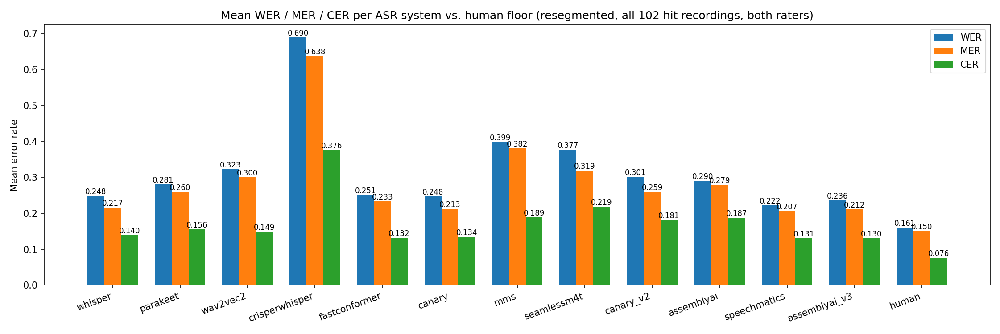
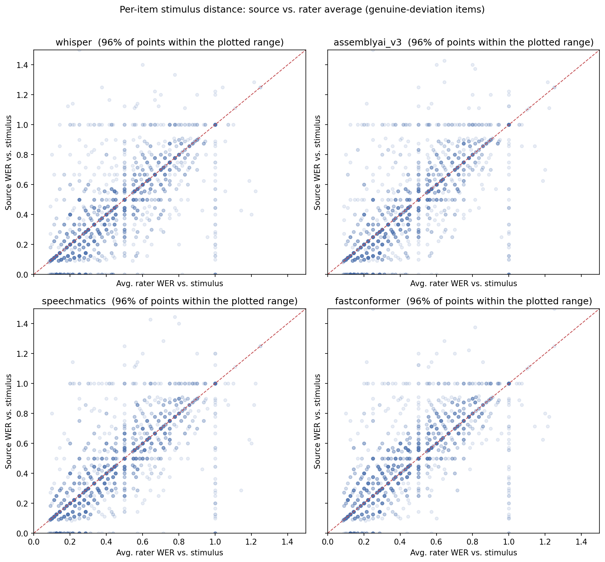

# ASR Model Comparison: Detailed Analysis

**Scope:** Every ASR model evaluated against AutoEIT's Elicited Imitation Task (EIT) recordings —
short (~1–15s), per-sentence, L2-accented Spanish speech — scored for transcription accuracy
against two independent human raters via WER/MER/CER.

**Last updated:** 2026-08-05, after adding `assemblyai` (Universal-2), `speechmatics` (Enhanced),
and `assemblyai_v3` (Universal-3.5 Pro + Speech-to-Text Prompting) as the 10th, 11th, and 12th
candidates — the first three commercial-API systems tried in this harness, alongside the nine
open-source models below — and after a follow-up, item-level check (§4.7) of whether any model
silently reverts to the scripted stimulus on items where a learner genuinely deviated from it.

**Primary evaluation set:** the resegmented data (`data/segmented/v2/`, windowed + 4s VAD
merge-gap — see [§2.2](#22-segmentation-two-generations)), scored on the 102 "hit" recordings
(`data/resegmented_hit_recordings.txt`) where the rank-based item↔sentence alignment against human
transcriptions is trustworthy. All numbers in this document are from that set unless explicitly
marked otherwise.

---

## 1. Executive Summary

Twelve ASR systems have been tried against this dataset: nine open-source models spanning three
decoder families (Whisper-style attention encoder-decoder, CTC, and RNNT/transducer) and a spectrum
of training-language breadth (4 languages to ~1,100), plus three commercial APIs added afterward
(`assemblyai`, `speechmatics`, `assemblyai_v3`) specifically to check whether a production-grade
system could do better than anything open-source tried so far. It could. The headline result,
restated up front because it recurs constantly below:

> **For the first time in this comparison, two systems clearly beat the old ~0.25 mean WER
> plateau: `speechmatics` (0.223 WER) and `assemblyai_v3` (0.236 WER, AssemblyAI's Universal-3.5
> Pro model paired with disfluency-preserving prompting).** `assemblyai_v3` additionally posts the
> **best CER (0.130) and best exact-match rate (37.0%) of any of the twelve models**, though
> `speechmatics` still edges it on WER/MER. Neither win is dramatic in absolute terms (~0.01–0.02
> WER over the old best), and every other pattern documented below still holds: a plain, unprompted
> commercial API (`assemblyai`, Universal-2) is still clearly worse than the open-source leaders,
> broader-language checkpoints of the same open-source architecture still lose to narrower ones, and
> a verbatim *fine-tune* (CrisperWhisper) still underperforms badly — it took disfluency-preserving
> **prompting** on top of a strong base model, not a fine-tune and not just "being a commercial
> API," to actually move the needle.

### 1.1 Full ranking table

| Rank | Model | Mean WER | Mean MER | Mean CER | Median WER | % Word-Perfect | Decoder family | Training language breadth | Eval scope |
|---|---|---|---|---|---|---|---|---|---|
| — | **Human floor** (rater1 vs. rater2) | **0.161** | 0.150 | 0.076 | 0.111 | 42.9% | n/a (human) | n/a | hit-only |
| 1 | **speechmatics** (Enhanced, batch) | **0.223** | 0.207 | 0.131 | 0.143 | 36.4% | End-to-end (proprietary, undisclosed) | Multilingual (breadth undocumented) | hit-only (102) |
| 2 | **assemblyai_v3** (Universal-3.5 Pro + prompting) | **0.236** | 0.212 | **0.130** | 0.125 | **37.0%** | End-to-end (proprietary, undisclosed) | 6 core languages (incl. Spanish) | hit-only (102) |
| 3 | **canary** (nvidia/canary-1b) | **0.248** | 0.213 | 0.134 | 0.143 | 36.8% | Attention (AED) | 4 languages | full (184) |
| 4 | **whisper** (faster-whisper large-v3) | **0.248** | 0.217 | 0.140 | 0.143 | 34.9% | Attention (AED) | ~99 languages (weakly-aligned web data) | full (184) |
| 5 | **fastconformer** (stt_es_fastconformer_hybrid_large_pc) | **0.251** | 0.233 | 0.132 | 0.167 | 29.7% | CTC | 1 language (Spanish-only) | full (184) |
| 6 | **parakeet** (parakeet-tdt-0.6b-v3) | **0.281** | 0.260 | 0.156 | 0.143 | 32.9% | RNNT/Transducer (TDT) | multilingual (curated) | full (184) |
| 7 | **assemblyai** (Universal-2, unprompted) | **0.290** | 0.279 | 0.187 | 0.143 | 35.0% | End-to-end (proprietary, undisclosed) | Multilingual (breadth undocumented) | hit-only (102) |
| 8 | **canary_v2** (nvidia/canary-1b-v2) | **0.301** | 0.259 | 0.181 | 0.167 | 32.7% | Attention (AED) | 25 languages | full (184) |
| 9 | **wav2vec2** (wav2vec2-xlsr-53-spanish) | **0.323** | 0.300 | 0.149 | 0.250 | 20.7% | CTC | 53 languages (pretrain), Spanish fine-tune | full (184) |
| 10 | **seamlessm4t** (seamless-m4t-v2-large) | **0.377** | 0.319 | 0.219 | 0.222 | 27.0% | Attention (S2TT) | ~100 languages | hit-only (102) |
| 11 | **mms** (facebook/mms-1b-all) | **0.399** | 0.382 | 0.189 | 0.286 | 20.5% | CTC | ~1,100 languages (adapters) | hit-only (102) |
| 12 | **crisperwhisper** (faster_CrisperWhisper) | **0.690** | 0.638 | 0.376 | 0.750 | 2.0% | Attention (AED), verbatim fine-tune | ~99 languages (Whisper base) | hit-only (102) |

*("Eval scope" — "full" means every one of the 184 valid resegmented recordings, hit and miss,
was transcribed; "hit-only" means the model was only run on the 102 recordings that are
scoreable, since those models were added purely as evaluation add-ons (or, for the commercial
APIs, are billed per item), not full pipeline candidates. See
[§2.3](#23-full-dataset-vs-hit-only-evaluation-scope).)*


### 1.2 The one-paragraph verdict

`speechmatics` (WER 0.223) and `assemblyai_v3` (WER 0.236, CER 0.130, 37.0% word-perfect — the
latter two are the best of any system tried) are now the top two systems, having overtaken the
long-standing `canary`/`whisper` tie (both still 0.248, still statistically indistinguishable from
each other) that held the top spot through nine straight open-source candidates. `fastconformer`
(0.251) remains within noise of that pair. `parakeet` and the plain, unprompted `assemblyai`
(Universal-2) occupy a similar tier (0.28–0.29) — notably, the *unprompted* commercial API does
**not** beat the open-source leaders, only the prompted one does, which matters for reading the
result correctly (see [§4.6](#46-commercial-apis-and-prompting-a-lever-distinct-from-architecture-or-training-breadth)).
`canary_v2`, `wav2vec2`, and `seamlessm4t` sit lower still (0.30–0.38). `mms` (0.40) and
`crisperwhisper` (0.69, a very clear outlier) remain the two weakest systems tried. All twelve
remain above the human inter-rater floor of 0.161 — even the best system (`speechmatics`) is wrong
roughly 1.4x as often as two trained human raters disagree with each other on the same audio (see
[§2.5](#25-the-human-floor)). Unlike every previous version of this document, **a model swap away
from the current baseline (`whisper`) now has a measurable accuracy case behind it** —
`speechmatics` or `assemblyai_v3` over `whisper` on raw WER — though the margin is modest and both
are paid commercial APIs rather than a free drop-in swap. That WER-only ranking isn't the final
word, though: [§4.7](#47-does-any-model-literally-revert-to-the-script-not-just-fail-to-correct-disfluent-speech)
finds `assemblyai_v3` has the single highest stimulus-correction rate of any of the twelve
systems — the most likely to silently smooth a learner's genuine deviation back to the script —
which changes which commercial system this project actually recommends; see
[§5](#5-recommendations).



---

## 2. Background and Methodology

### 2.1 The task

AutoEIT's Elicited Imitation Task (EIT) presents a learner with a spoken Spanish sentence and asks
them to repeat it back. Recordings are one WMA/MP3 file per test session, containing dozens of
per-item responses (roughly 30–75 depending on the recording) at automatically-detected speech
boundaries. The ASR problem here is unusual in a way that matters for every result below:

- **Very short utterances.** Most items are 1–15 seconds — a single sentence, not a paragraph.
  There's little context for a language model to lean on, and no opportunity for errors to "average
  out" over a long transcript the way they might in dictation-style ASR benchmarks.
- **L2-accented, disfluent speech.** Learners mispronounce words, self-correct mid-sentence,
  hesitate, and sometimes produce speech that isn't fully grammatical Spanish. This is the actual
  research signal (that's the whole point of an Elicited Imitation Task — it's diagnostic of
  learner competence) but it's exactly the kind of input general-purpose ASR systems are *not*
  optimized for: most training data (read audiobooks, podcasts, web video) is fluent, native-speaker
  speech.
- **The evaluation target is verbatim transcription, not "what a fluent speaker would have said."**
  This distinction turns out to be the single biggest predictor of failure across every model tried
  — see [§6.1](#61-does-an-attention-decoder-inherently-correct-disfluent-speech).

### 2.2 Segmentation: two generations

Two different automatic segmentations of the raw recordings have been used over the course of this
project:

- **`v1`** — the original Silero-VAD segmentation, 2.5s merge-gap threshold, unwindowed (covers the
  entire recording including the English instruction preamble).
- **`v2` / "resegmented"** (`data/segmented/v2/`) — windowed to just the Spanish target-sentence
  region (English-instructions-end to last-Spanish-target-sentence-end, computed per recording),
  re-run with Silero VAD using a **4s** merge-gap threshold instead of 2.5s. This raises the "hit"
  rate — recordings that land on exactly 30 detected items, matching the actual number of Spanish
  EIT stimuli per recording — from 45.7% to 55.4% (102 of 184 valid recordings, vs. 84 previously),
  at a small cost in over-merging (items >10s: 2.0% → 5.0%).

All twelve models in this document were run against `v2` (the resegmented data). The very first
three models (`whisper`, `parakeet`, `wav2vec2`) were originally also evaluated on `v1`, and the
ranking held: whisper best, then parakeet, then wav2vec2, on both segmentations. That consistency
is one reason to trust the `v2` numbers as representative rather than an artifact of one particular
segmentation choice.

A recording only becomes *scoreable* (gets WER/MER/CER numbers, not just raw transcriptions) if it
is a "hit" — because scoring relies on a **rank-based item↔sentence alignment**: item *N* of the
ASR transcript is matched to sentence *N* of the human-rater transcript by position, not by
content. If the automatic segmentation over- or under-splits (a "miss" recording — anything other
than exactly 30 items), that positional alignment becomes unreliable, so those recordings are
transcribed (where the model was run on the full dataset) but excluded from scoring.

### 2.3 Full-dataset vs. hit-only evaluation scope

Not every model was transcribed against the same set of recordings:

- **Full dataset (184 recordings, hit and miss):** `whisper`, `parakeet`, `wav2vec2`,
  `fastconformer`, `canary`, `canary_v2`. These were treated as full pipeline candidates from the
  start, so they cover every valid recording even though only the 102 hits get scored.
- **Hit-only (102 recordings):** `crisperwhisper`, `mms`, `seamlessm4t`, `assemblyai`,
  `speechmatics`, `assemblyai_v3`. The first three were added purely as evaluation data points
  against the existing WER/MER/CER comparison; the three commercial APIs were restricted for a
  second, more direct reason — every item is a billed API call, so running them on unscoreable
  "miss" recordings would have cost real money for no analytical benefit.

This distinction doesn't bias the WER/MER/CER *comparison* (all twelve are scored on the same 102
hit recordings), but it does mean the hit-only models have no "miss" transcriptions available for
any future segmentation-quality analysis.

### 2.4 Scoring: WER, MER, and CER

All three metrics are computed via [`jiwer`](https://github.com/jitsi/jiwer), after lowercasing and
stripping punctuation (`normalize_text()` in `src/postprocessing/build_postprocessed_csv.py`),
scored independently against **both** human raters (so each scoreable item contributes two rows —
one per rater — to every mean/median below):

- **WER (Word Error Rate)** = (Substitutions + Deletions + Insertions) / N, where N is the number
  of words in the reference (human) transcript. This is the standard ASR metric, but it is
  **unbounded above 1.0** when a hypothesis contains many more words than the reference
  (insertion-heavy hallucination can push WER arbitrarily high on a single item).
- **MER (Match Error Rate)** = (S + D + I) / (S + D + C + I), where C is the count of correctly
  matched words. Same edit operations as WER, but the denominator is bounded, so MER is always in
  [0, 1] — it doesn't get distorted by the rare catastrophic insertion-heavy item the way WER's mean
  can.
- **CER (Character Error Rate)** — the same Levenshtein-distance idea as WER, but computed over
  characters instead of words. More forgiving of near-miss inflection/spelling errors ("tiene" vs.
  "tienen") and less sensitive to how a language's words happen to tokenize.
- **% Word-Perfect** — the fraction of scored items with WER exactly 0.0, i.e. an exact match to
  the reference after normalization. This is a stricter, more interpretable number than mean WER
  for judging "how often does this system just get it completely right."

### 2.5 The human floor

Before judging any ASR number in isolation, it's worth establishing what the *best possible* score
would look like — because "wrong" is not a well-defined concept in isolation when two independent
human transcribers, listening to the same audio, don't produce identical transcripts either. They
mishear disfluent or accented words differently, choose different spellings, and transcribe filler
sounds inconsistently.

`notebooks/model_comparison/analyze_interrater_agreement.ipynb` computed this directly: rater 1's transcript scored
against rater 2's transcript, same WER/MER/CER, same normalization, same rank-based alignment
convention as ASR-vs-human scoring. Results:

- **Globally** (182 recordings with a matched human sheet, not restricted to hits): mean WER
  0.216, MER 0.201, CER 0.116. Even two trained human raters, transcribing the same audio
  independently, land on a different word roughly 1 time in 5.
- **On the 102-recording hit-only subset** used throughout this document: mean WER 0.161, MER
  0.150, CER 0.076 — noticeably *lower* than the global floor, suggesting the harder-to-align
  "miss" recordings (longer or more disfluent responses, presumably) are also harder for humans to
  transcribe consistently, not just harder to auto-segment.

The practical upshot: the best ASR system tried (`canary`/`whisper`, WER ≈ 0.248) is about
**1.5–1.7x** the inter-rater floor (0.161), and this ratio has been essentially constant across
every intermediate result in the project (0.152 vs. 0.252 on the original segmentation; 0.161 vs.
0.248 on the resegmented one). That means:

1. Current ASR error is **real, not mostly ground-truth noise** — roughly 40% of the gap between
   0.25 and 0.16 mean WER is plausibly fixable error, not baked-in ambiguity in what was actually
   said.
2. But **a WER of 0 is not a realistic target for this task** — 0.15–0.16 is the practical ceiling,
   because that's the rate at which two careful humans naturally disagree on this kind of speech.

---

## 3. Per-Model Analysis

Models are presented in the order they were introduced to the project, since later additions were
often explicitly motivated by earlier results (this matters for understanding *why* each one was
tried, not just how it scored). §3.1–§3.9 are the nine open-source models; §3.10–§3.12 are the
three commercial APIs added afterward, once the open-source search had converged on the ~0.25 WER
plateau discussed in §4.5.

### 3.1 Whisper large-v3 (`faster-whisper`) — the baseline

**Architecture:** Attention-based sequence-to-sequence transformer encoder-decoder. Trained by
OpenAI on 680k hours of weakly-aligned, web-scraped multilingual audio/text pairs — the largest and
most diverse training set of any model in this comparison by a wide margin, but also the noisiest
(no curated alignment guarantee between audio and text).

**Configuration used:** `beam_size=1, temperature=0, condition_on_previous_text=False,
word_timestamps=True`, run via the CTranslate2-optimized `faster-whisper` implementation for
speed. Language was auto-detected in the original `v1` pipeline (`transcribe.py`) but hardcoded to
`"es"` from `transcribe_v2.py` onward, once it became clear the task was Spanish-only past the
English instruction preamble.

**Why it's the baseline:** It's the model the project started with, and remains a genuinely strong
result — it is statistically tied for best (mean WER 0.248) across every model tried since.

**Known failure mode — hallucination on silence/low-signal audio, independent of the accuracy
numbers above:** per an advisor Q&A session (2026-07-06; the advisor runs the *production*
`autoeit.org` platform — a separate, independent English-EIT system, not this project's own —
which uses AssemblyAI rather than any model in this comparison), Whisper reliably
hallucinates filler phrases — "gracias", "thank you very much" — into silent or quiet segments,
even with no initial prompt supplied. More severe hallucinations (fabricated YouTube-style video
outros, looped phrases) were documented in an earlier RMAL paper but were specifically tied to
*initial-prompt* use, which this pipeline doesn't use. This is a qualitatively different failure
mode from the WER/MER/CER numbers above — it shows up as spurious extra content on clips that
should be empty or near-empty, rather than as wrong words replacing correct ones on clips with real
speech.

**Why it performs the way it does:** Whisper's strength here is almost certainly its training data
scale and its full seq2seq decoder's ability to exploit sentence-level context, even on short
clips — it can use its implicit language-model prior to disambiguate acoustically ambiguous words.
That same prior is also its liability: the working hypothesis for much of this project (see
[§6.1](#61-does-an-attention-decoder-inherently-correct-disfluent-speech)) was that this same
language-model prior would "correct" disfluent L2 speech toward fluent, grammatical Spanish rather
than transcribing what was actually said — which would be a serious problem for a task where the
disfluencies *are* the research signal. That hypothesis motivated trying Parakeet, then Wav2Vec2,
then CrisperWhisper, then FastConformer and Canary. It has **not** been strongly confirmed in
aggregate WER/MER/CER terms — Whisper still wins or ties for the best score overall — but the
hallucination behavior above is a related, real phenomenon worth keeping in mind for any deployment
decision, since WER doesn't fully capture it (an occasional hallucinated "gracias" on an
otherwise-silent clip barely moves an aggregate mean but could still matter for downstream use).

### 3.2 NVIDIA Parakeet-TDT-0.6B-v3

**Architecture:** FastConformer encoder + TDT (Token-and-Duration Transducer) decoder — the RNNT
family, distinct from both Whisper's full autoregressive attention decoder and the CTC models
below. Much smaller than Whisper large-v3 (0.6B vs. ~1.5B parameters) and, per the same advisor
Q&A, CPU-viable and specifically flagged as a promising open-source alternative to AssemblyAI for
the advisor's own `autoeit.org` platform (beating Whisper on spontaneous speech, though not quite
matching it on read speech, in the advisor's own informal testing).

**Why it was tried:** The verbatim-preservation hypothesis above — a transducer's decoding process
is less prone to smoothing disfluent input toward fluent output than a full seq2seq decoder with an
implicit language model, similar in spirit to why CTC models were tried (see 3.3).

**Results:** Mean WER 0.281, clearly behind whisper/canary/fastconformer but ahead of
wav2vec2/seamlessm4t/mms/crisperwhisper. No native per-word confidence score is exposed by this
model's inference API (`mean_word_prob` is always null in its summaries), unlike Whisper's.

**Why it performs the way it does:** Parakeet lands in the middle of the pack rather than at either
extreme — consistent with the advisor's own read that it's competitive but "not quite" beating
Whisper, at least not on this particular read-speech-adjacent task (Elicited Imitation is closer to
constrained/read speech than fully spontaneous speech, per the same advisor conversation — the
task prompts a specific target sentence, which narrows the answer space and reduces disfluency
relative to open-ended spontaneous speech). A spot-check during initial testing found Parakeet
correctly transcribing "él" (with the accent and initial letter) where Wav2Vec2 dropped it —
a small but suggestive data point that its acoustic modeling may be slightly more robust than
Wav2Vec2's on this accented speech, even though neither beats Whisper/Canary in aggregate.

### 3.3 Wav2Vec2-XLSR-53-Spanish (`jonatasgrosman/wav2vec2-large-xlsr-53-spanish`)

**Architecture:** CTC (Connectionist Temporal Classification) — a frame-synchronous classifier with
**no autoregressive decoder and no implicit language-model prior over its own output** at all. It
can only emit what the acoustic encoder heard, frame by frame, with no mechanism to "smooth" a
sequence of frame-level predictions toward a more fluent or grammatical hypothesis. Pretrained via
self-supervision on XLSR-53 (53 languages), fine-tuned specifically on Spanish (CommonVoice-derived
data, per the HF community fine-tune this model is).

**Why it was tried:** The first concrete test of the verbatim-preservation hypothesis — the
"architecturally different" candidate that `docs/asr_model_alternatives.md` specifically called
out, precisely because CTC's failure mode was predicted to be *categorically* different from
Whisper's: literal phonetic garbling rather than fluent-sounding invented text.

**Results:** Mean WER 0.323 — worse than whisper/parakeet/canary/fastconformer, but notably better
than the two other CTC models added later (`mms`, and — on CER only — comparable to
`seamlessm4t`). No native word-timestamp API, so `_decode_words_with_timestamps()` does a manual
greedy CTC decode (collapse repeated frames, drop blank tokens, split on the word-delimiter token),
deriving frame length from `duration / num_frames` directly rather than assuming a fixed frame
rate.

**Why it performs the way it does:** CTC's lack of a language-model prior is a double-edged sword,
and the aggregate numbers show the "edge" that cuts against it more than the one that helps: with
no sentence-level context to disambiguate an acoustically ambiguous frame, wav2vec2 makes more
outright acoustic errors than the attention-decoder models, even though (per the original
motivating hypothesis) it should in principle preserve disfluencies more faithfully when it does
hear them correctly. wav2vec2 remains the strongest of the three CTC models tried (see 3.7 for why
`mms`, trained far more broadly, does worse specifically because of that breadth) — it is the
"CTC done well, narrowly" reference point the rest of this comparison's CTC results should be read
against.

### 3.4 CrisperWhisper (`nyrahealth/faster_CrisperWhisper`)

**Architecture:** A Whisper large-v3 fine-tune, retokenized and retrained specifically for
*verbatim* transcription — its explicit training objective is to **keep** disfluencies (fillers,
false starts, stutters) that standard Whisper tends to smooth away. On paper, this is the most
direct test of the verbatim-preservation hypothesis of any model tried, since it addresses the
hypothesized problem via training objective rather than architecture.

**Why it was tried:** If Whisper's fluency-correction behavior really is the main source of
disagreement with these raters, a Whisper variant explicitly fine-tuned against exactly that
behavior should show a clear win. It didn't — see below.

**Bugs found and fixed before the real run** (both worth documenting in detail, since they
materially affected the result and are a good illustration of how much a naive port of one model's
inference config to another can silently break):

1. **Severe repetition-loop hallucination.** `transcribe.py`'s convention of passing a fixed
   `temperature=0` to `model.transcribe()` was copied unmodified into the first version of
   `transcribe_crisperwhisper.py`. But faster-whisper's actual default behavior is a **temperature
   fallback list** (`[0.0, 0.2, 0.4, 0.6, 0.8, 1.0]`): when a temperature-0 decode comes back too
   repetitive (checked via `compression_ratio_threshold`), it automatically retries at a higher
   temperature. Passing a fixed scalar disables that retry entirely. A partial scan (~400 items)
   found a **14.89% severe-collapse rate** for CrisperWhisper under the fixed-temperature setting
   (e.g. `"Me me me me me..."` repeated 111 times, filling an entire 5.7-second clip) vs. only
   0.06% for plain Whisper under the *same* fixed-temperature setting on the *same* audio — meaning
   the retokenized verbatim vocabulary itself is far more prone to this decoding pathology, not the
   parameter choice alone. Fix: removed the fixed `temperature=0` from
   `transcribe_crisperwhisper.py` specifically (left `transcribe.py` untouched, since Whisper's own
   collapse rate was already negligible and not worth risking a change to already-published
   results), and added `no_repeat_ngram_size=3` as a hard backstop for the rare clip that still
   degraded even at the highest fallback temperature. After the fix: 0.00% severe collapse across
   the full 3,060-item run.
2. **Tokenizer comma artifact.** This CT2 conversion's retokenized vocabulary marks word boundaries
   with a leading `,` instead of a leading space (e.g. tokens `"Ella"`, `",ya"`, `",terminaba"`) —
   a property of the converted checkpoint itself, present regardless of the `without_timestamps`
   flag. `_clean_word()` strips this so joined text reads normally, while leaving genuine verbatim
   markers like `"[UM]"` untouched.

**A separate, unfixed quality issue: fused words.** ~14.84% of the final 3,060 scored items (454)
contain a word token with no space or separator at all — e.g.
`"Megustalospelículasqueacabenbien"` for "Me gusta las películas que acaben bien" — spread across
~9 different recordings, not concentrated in one bad file. Confirmed the audio itself isn't the
cause (plain Whisper transcribes the same recordings cleanly). Confidence on these fused tokens is
consistently depressed (0.37–0.65, vs. typically 0.85+ elsewhere), suggesting genuine model
uncertainty about word-boundary placement on harder audio, not a decoding bug like the collapse
above. **Decision: left as-is.** Unlike the repetition-loop collapse (a decoding artifact
independent of the model's actual judgment), a fused word is arguably a real transcription error
the model made, and reinserting guessed spaces would misrepresent what it actually produced — it's
counted against WER as-is, and flagged as a caveat rather than patched.

**Results:** Mean WER 0.690, MER 0.638, CER 0.376 — by a wide margin the **worst system in this
entire comparison**, roughly 2.8x the best system's WER and over 4x the human floor. Only 2.0% of
items are word-perfect, vs. 34.9% for whisper.

**Why it performs so badly, even after fixing both bugs:** Two compounding factors, neither of
which is really about "verbatim vs. fluent" in the way the original hypothesis framed it:

1. **The human raters themselves transcribe fairly cleaned-up text**, per the inter-rater agreement
   analysis — they're not producing maximally verbatim ground truth either. A model explicitly
   optimized to preserve every disfluency is therefore optimizing for agreement with an idealized
   verbatim ground truth that doesn't actually match how these particular raters transcribe. Its
   training objective and the actual scoring target are subtly misaligned.
2. **The fused-word rate (~15%)** is a straightforward, uncorrelated source of WER/CER damage on
   top of the objective mismatch — every fused-word item is guaranteed at least one substitution
   error against the reference's correctly-spaced words.

**Conclusion carried forward:** verbatim-transcription fidelity, at least as CrisperWhisper's
fine-tuning approach implements it, did not translate into better agreement with these particular
raters. This result specifically motivated the *architectural* (rather than fine-tuning) approach
to verbatim preservation tried next — FastConformer's CTC head and Canary's non-Whisper
attention decoder (§3.5, §3.6) — which both performed far better, suggesting the fine-tuning
route to this goal was the wrong lever, not the goal itself.

### 3.5 FastConformer (`nvidia/stt_es_fastconformer_hybrid_large_pc`)

**Architecture:** A hybrid Transducer-CTC model, decoded here specifically via its **CTC head**
rather than its RNNT head. Like Wav2Vec2, this means no autoregressive decoder and no
language-model prior over its own output — but unlike Wav2Vec2, it's a **monolingual, Spanish-only**
acoustic model rather than a multilingual pretrain with a Spanish fine-tune layered on top.

**Why it was tried:** A more direct test of the verbatim-preservation goal than Canary (tried
alongside it — see 3.6), specifically isolating "does a CTC head, with zero autoregressive
component, do better than an attention decoder on this task" while holding "trained specifically
and only for Spanish" constant (unlike Wav2Vec2's broader XLSR-53 pretrain, or MMS's much broader
one added later). Cost: no per-word confidence output (`mean_word_prob` always null, same
limitation as Parakeet).

**Results:** Mean WER 0.251 — essentially tied with whisper (0.248) and canary (0.248), a
**~0.003 gap well within noise for this dataset**, and it actually *edges out* both on CER (0.132,
vs. whisper's 0.140 and canary's 0.134) despite having no autoregressive decoder to clean up its
raw acoustic output and no per-word confidence signal to filter with.

**Why it performs the way it does:** This is arguably the single most informative result in the
whole comparison for testing the original "attention decoders correct toward fluency" hypothesis.
FastConformer has *zero* autoregressive language-model component — it cannot smooth disfluent
speech toward a more grammatical hypothesis even if it "wanted" to, since its CTC head is a purely
frame-synchronous classifier. If Whisper's language-model prior really were the dominant source of
disagreement with these human raters, FastConformer should have won clearly. It didn't — it landed
in a *statistical tie* with Whisper and Canary, not ahead of them. That's a meaningful negative
result: **the presence or absence of an autoregressive decoder does not, by itself, explain the
observed differences between systems on this dataset.** What matters more (see
[§6.3](#63-breadth-vs-depth-does-broader-training-data-help-or-hurt)) appears to be how narrowly
each checkpoint specializes in Spanish specifically — and FastConformer, like the top two systems,
is trained exclusively (Whisper, effectively via scale) or specifically (FastConformer, Canary) for
this exact language, rather than spreading capacity across dozens or hundreds of others.

Compared directly against CrisperWhisper (the other "verbatim-leaning" candidate, but via
fine-tuning rather than architecture): FastConformer wins by a wide margin (WER 0.251 vs. 0.690),
suggesting the CTC-head route to disfluency preservation generalizes to these raters far better
than CrisperWhisper's fine-tuning approach did — reinforcing the conclusion from §3.4 that the
*training objective* (verbatim fine-tune vs. specialized-Spanish-CTC) mattered more than the
"verbatim" framing itself.

### 3.6 NVIDIA Canary-1B (`nvidia/canary-1b`)

**Architecture:** A FastConformer **encoder** paired with a **Transformer attention decoder**
(AED — attention-based encoder-decoder), architecturally much closer to Parakeet/FastConformer's
encoder than to Whisper, but still autoregressive and attention-based on the decoder side, like
Whisper. Multi-task (ASR + speech translation), trained on 4 languages: English, German, French,
Spanish.

**Why it was tried:** The second, complementary test of whether attention-decoder architectures
inherently reproduce Whisper's fluency-correction behavior. FastConformer (§3.5) already showed a
*non*-attention-decoder model doesn't clearly beat Whisper; Canary tests the flip side — does an
attention-decoder model that *isn't* Whisper (different encoder, different training data, much
narrower language set) still show the correction problem, or is it specific to Whisper's own
training recipe?

**A word-timestamp bug was found and fixed while transcribing this model** — worth documenting
because it's a good example of a silent-failure trap in the NeMo API: `nvidia/canary-1b`'s decoder
never emits the special `<|N|>word<|N|>` timestamp tokens that NeMo's timestamp-extraction logic
looks for (only newer Canary checkpoints with a bundled forced-aligner model support that). The
first full run silently wrote all 5,062 items with `"segments": []` — discarding every
transcription even though `hyp.text` held the correct text the whole time, because the code was
only reading from the (always-empty) timestamp-derived segment list. Fix: `transcribe_canary.py`
now falls back to a single segment spanning the whole clip (using `hyp.text` directly) whenever the
timestamp-derived segments come back empty — no transcription content is lost, only the per-word
timestamp granularity this checkpoint genuinely can't provide. (This limitation is exactly what
motivated trying `canary-1b-v2` later — see §3.9.)

**Results:** Mean WER 0.248, MER 0.213, CER 0.134 — **the best-scoring system in this entire
comparison**, edging out Whisper on WER (tied to 3 decimal places) and MER, and landing within
noise of FastConformer on CER. Highest word-perfect rate of any system, 36.8%.

**Why it performs the way it does:** Canary retains an attention-based autoregressive decoder
(architecturally similar to Whisper's decoder shape) but doesn't reproduce Whisper's degree of
fluency-correction behavior in aggregate — which, combined with FastConformer's result above, is
strong evidence against the "any attention decoder inherently corrects toward fluency" version of
the original hypothesis (see [§6.1](#61-does-an-attention-decoder-inherently-correct-disfluent-speech)
for the fuller cross-model discussion). What Canary and Whisper *do* share, and what plausibly
matters more, is that both are trained on high-quality, curated multi-task data that includes
Spanish as a first-class target — Canary narrowly (4 languages), Whisper broadly but at massive
scale (Spanish is one of the best-represented languages in Whisper's training mix even among ~99
total). Canary is also the strongest evidence in this whole comparison that the disfluency-handling
question and the "which model wins" question are more separable than the original hypothesis
assumed: an attention decoder *can* do well here, provided the underlying training data/recipe is
strong for the target language specifically.

### 3.7 Facebook MMS (`facebook/mms-1b-all`)

**Architecture:** CTC, structurally identical to Wav2Vec2's decode path (same
`Wav2Vec2ForCTC`/`Wav2Vec2Processor` API — `transcribe_mms.py` literally reuses
`transcribe_wav2vec2.py`'s word-decoding logic unmodified) — but trained on **~1,100 languages**
via per-language adapter weights, instead of XLSR-53's 53. The Spanish adapter
(`target_lang="spa"`) is loaded explicitly at inference time; loading the adapter *values*
(not just resizing the output head to the right vocabulary size) requires an explicit
`load_adapter()` call after `from_pretrained()` — a subtlety confirmed during setup by comparing
against a known-good Wav2Vec2 output on the same clip, since a shape-mismatch warning during
loading could otherwise be mistaken for a sign the adapter weights hadn't loaded correctly.

**Why it was tried:** The direct head-to-head test the project had been building toward on the CTC
side: does MMS's much broader (~1,100-language) but per-language-diluted training help or hurt,
relative to Wav2Vec2-XLSR-53's narrower (53-language pretrain) but dedicated Spanish fine-tune?
Both share the exact same CTC decoding shape and have no autoregressive language-model prior, so
this isolates training-data breadth as the one varying factor.

**Results:** Mean WER 0.399, MER 0.382, CER 0.189 — clearly worse than Wav2Vec2 (0.323) on
**every** metric, with an essentially identical word-perfect rate (20.5% vs. 20.7%, i.e. no
tradeoff even on the one metric where a narrower gap might be expected). MMS is the **second-worst
system overall**, beating only CrisperWhisper.

**Why it performs the way it does:** This is the cleanest evidence in the whole comparison for
"training breadth dilutes per-language capacity." With CTC architecture, decoding shape, and
absence of a language-model prior all held constant between MMS and Wav2Vec2, the only material
difference is how many languages the model had to learn to represent — 53 vs. ~1,100 — and the
narrower model wins clearly. MMS's adapter mechanism (a per-language output layer bolted onto a
shared encoder) evidently doesn't fully compensate for the encoder itself having to represent
acoustic patterns for ~20x as many languages.

**Qualitative failure mode — literal phonetic garbling, as predicted for CTC:**
`docs/asr_model_alternatives.md` predicted CTC models would fail via literal phonetic garbling
rather than fluent-sounding hallucination, since there's no language-model prior to invent
plausible-but-wrong text. MMS's errors bear this out directly. For the stimulus "El se ducha cada
mañana" ("He showers every morning"), MMS produced **"ela seduta cara manhana"** — nonsensical as
Spanish, but still clearly phonetically tethered to the source audio, syllable by syllable. Compare
this to SeamlessM4T's completely different failure mode on the *exact same clip* (§3.8) — a
striking same-input, different-architecture natural experiment.

### 3.8 SeamlessM4T v2 (`facebook/seamless-m4t-v2-large`)

**Architecture:** Attention-based encoder-decoder, architecturally in the same broad family as
Whisper and Canary — but its training objective is **speech-to-text translation (S2TT)**, not ASR.
Transcription here is achieved by pinning both source and target language to Spanish
(`tgt_lang="spa"`), so the model is technically "translating" Spanish speech into Spanish text —
same-language translation as a degenerate/edge case of its actual training task, rather than direct
transcription being the primary objective it was optimized for. No native word-level timestamps
(`generate()` only returns text tokens, no forced alignment) and no per-word confidence, same
limitation as Canary v1/Parakeet.

**Why it was tried:** A third data point on attention-decoder behavior (alongside Whisper and
Canary) and, distinctly, a genuinely different *training objective* from every other model tried —
worth checking whether a massively multilingual translation-first model, repurposed for ASR,
competes with dedicated ASR models at all.

**Results:** Mean WER 0.377, MER 0.319, CER 0.219 — worse than every attention-decoder model tried
(Whisper 0.248, Canary 0.248) by a wide margin, and specifically the **largest CER gap of any
system except CrisperWhisper** (0.219 vs. Whisper's 0.140) — a hint that its errors are more
"expensive" per error, in characters, than most other systems' errors.

**Why it performs the way it does:** The S2TT training objective looks like the actual culprit,
more than the attention-decoder architecture per se — Whisper and Canary are trained directly
*for* transcription; SeamlessM4T is trained to translate speech into text in a
possibly-different target language, with same-language "translation" only an edge case of that
broader objective rather than something it was specifically optimized to do well. That distinction
shows up clearly and qualitatively: on the exact same stimulus MMS garbled above ("El se ducha cada
mañana"), SeamlessM4T produced **"el jefe de la policía"** ("the chief of police") — a completely
fluent, grammatically correct Spanish sentence with **no discernible relationship** to the source
audio, phonetic or semantic. This is the fluent-hallucination failure mode Whisper was originally
hypothesized to show, but taken further: Whisper's hallucinations (per §3.1) tend to be short filler
phrases inserted into silence; SeamlessM4T's can be entire unrelated sentences replacing real
content, consistent with a model that was trained to produce fluent, plausible target-language
output rather than to faithfully track the source audio word-for-word.

Against MMS specifically (the other new CTC-vs-attention data point added in the same run):
SeamlessM4T scores *better* on WER and MER (0.377/0.319 vs. MMS's 0.399/0.382) but *worse* on CER
(0.219 vs. 0.189) — consistent with the two failure modes being different in kind, not just in
degree. MMS's phonetic-garbling errors tend to still resemble the target word (wrong word, similar
length/sound, so each error costs relatively few characters); SeamlessM4T's occasional
whole-sentence hallucinations replace long, unrelated phrases outright, costing more characters per
error even on the (fewer) occasions when they cost fewer word-level edits than MMS's more frequent,
smaller garbling errors.

### 3.9 NVIDIA Canary-1B-v2 (`nvidia/canary-1b-v2`)

**Architecture:** Same FastConformer-encoder + Transformer-attention-decoder architecture as
`canary-1b` (§3.6) — this is explicitly a newer **checkpoint** of the same architecture, not a
different design. Released 2026-06-23 (about a month before this evaluation), expanding language
coverage from Canary v1's 4 languages to **25** (Bulgarian, Croatian, Czech, Danish, Dutch,
English, Estonian, Finnish, French, German, Greek, Hungarian, Italian, Latvian, Lithuanian,
Maltese, Polish, Portuguese, Romanian, Slovak, Slovenian, Spanish, Swedish, Russian, Ukrainian).
Loaded via NeMo's generic `ASRModel.from_pretrained()` rather than v1's more specific
`EncDecMultiTaskModel.from_pretrained()`, though it resolves to the same underlying
`EncDecMultiTaskModel` class once loaded. Critically, **its decoder does emit real word-level
timestamp tokens**, fixing v1's exact limitation (§3.6) — confirmed directly via a smoke test
before committing to the full run (`nemo_toolkit` 2.7.3 was already new enough; the model card's
warning about needing the NeMo main branch applied to an older NeMo release than what's installed
here).

**Why it was tried:** The cheapest, most directly targeted follow-up available in this whole
comparison — Canary v1 is already the best-scoring system overall, so a same-architecture
checkpoint upgrade that also happens to fix its one clear limitation (no word timestamps) looked
like a strict improvement to check for, not a speculative new architecture bet.

**Results — the newer checkpoint is clearly worse, not better:**

| | canary (v1) | canary_v2 |
|---|---|---|
| Mean WER | **0.248** | 0.301 |
| Mean MER | **0.213** | 0.259 |
| Mean CER | **0.134** | 0.181 |
| % word-perfect | **36.8%** | 32.7% |
| Head-to-head wins (of 3,441 tied + 2,438 decided items) | **1,672** | 766 |

v2 dropped from **1st place overall (of 8)** to **5th place (of 9)**, landing between `parakeet`
and `wav2vec2`. This isn't a few outlier clips dragging the mean down — per-item, v1 wins on nearly
2.2x as many disagreement cases as v2 does.

**Why it performs the way it does:** This result reproduces the exact same pattern documented for
MMS vs. Wav2Vec2 in §3.7 — **broadening language coverage on an otherwise-identical architecture
hurt accuracy on this narrow, L2-accented Spanish task.** Canary v1's 4-language training set
included Spanish as one of a small handful of first-class targets; v2 spreads the same architecture
and (presumably comparable) parameter budget across 25 languages instead. The pattern recurring
*twice*, on two structurally very different model families (a CTC adapter-based model, and now an
attention-decoder multi-task model), is stronger evidence than either instance alone that this is a
general property of this dataset's difficulty profile — not an artifact specific to MMS's adapter
mechanism or Wav2Vec2's particular fine-tune.

v2's one genuine, unambiguous improvement is **output richness, not accuracy**: because it actually
emits timestamp tokens, its `word_count` field averages ~7.4 words/item with real per-word
timing, versus v1's `word_count` being a constant **0** for every single item (a direct consequence
of the whole-clip-fallback fix in §3.6 — v1's fallback segment always has `words: []`, since the
checkpoint provides no timestamp data to build a word list from at all). Still no per-word
confidence score for either version. If downstream tooling ever needs real word-level alignment,
v2 is the only Canary checkpoint that can provide it — but that capability doesn't offset the
accuracy regression for the transcription-quality use case this comparison is about.

**Conclusion:** do **not** swap `canary-1b` for `canary-1b-v2` on this dataset. `canary-1b` (v1)
remains the strongest open-source system, tied with `whisper` — though see §3.10–§3.12 below,
where two of the three commercial APIs added afterward beat both.

### 3.10 AssemblyAI Universal-2 (`assemblyai`)

**Architecture:** Proprietary, end-to-end commercial API — AssemblyAI does not publicly disclose
Universal-2's internal architecture, so unlike every open-source model above this is a black box
by design. Accessed via the `assemblyai` Python SDK.

**Why it was tried:** advisor-directed, not hypothesis-driven like the nine open-source models
above. AssemblyAI is the actual ASR backend the production `autoeit.org` platform runs on (not
Whisper — see §3.1's note on the RMAL-paper-vs-production distinction), and the advisor's own
informal, qualitative impression was that it avoided Whisper's hallucination/cleanup problems in
production use. That preference had never been checked against this project's own WER/MER/CER
numbers before this session. Explicitly pinned to **Universal-2** (`speech_models=["universal-2"]`,
the plural field — the singular `speech_model` enum has no Universal-2 member) rather than
AssemblyAI's current default, specifically to evaluate the actual production model, not the newest
release. `disfluencies=True` was set so filler words aren't stripped before scoring, matching the
project's verbatim-transcription scoring target throughout.

**Results:** Mean WER 0.290, MER 0.279, CER 0.187 — worse than `whisper` (0.248) on every metric,
and specifically the **worst CER of any model except the two bottom-tier outliers**
(`seamlessm4t`/`mms`/`crisperwhisper`), worse even than `wav2vec2` (0.149) despite `wav2vec2`'s
much higher WER/MER — suggestive of AssemblyAI's mistakes skewing toward larger word-level
substitutions rather than near-miss character edits. It does essentially tie `whisper` on
exact-match rate (35.0% vs. 34.9%).

**Why it performs the way it does:** unknown in architectural terms (proprietary), but the
practical reading is clear: **the advisor's qualitative production preference for AssemblyAI over
Whisper — driven by avoiding hallucination/cleanup issues, not raw accuracy — does not carry over
to a measured accuracy win on this Spanish EIT dataset**, at least not with the default
disfluency-preservation setting alone. That gap between "feels better in production" and "scores
worse on WER/MER/CER" is exactly what motivated trying the same vendor's newer model with an
explicit prompting strategy next (§3.12) — the plain API call, on its own, wasn't enough.

### 3.11 Speechmatics Enhanced (`speechmatics`)

**Architecture:** Proprietary, end-to-end commercial API, same black-box caveat as AssemblyAI
above. Accessed via the async-only `speechmatics-batch` SDK's `AsyncClient` (wrapped in a single
`asyncio.run()` per file, since no sync client exists).

**Why it was tried:** with AssemblyAI Universal-2 showing a mixed result (§3.10 — ties `whisper` on
exact-match, but loses on every error-rate metric), the natural next question was whether other
commercial disfluency-preserving ASR APIs would do better. Speechmatics and Rev.ai were the two
closest fits (both offer an explicit verbatim/hesitation-preserving mode, unlike Google/Azure's more
aggressive default cleanup); Speechmatics was run first (Rev.ai's per-file 15-second minimum charge
made a full run prohibitively expensive against the account's free trial balance — written but not
yet run). `transcript_filtering_config=TranscriptFilteringConfig(remove_disfluencies=False)` is set
explicitly (matching the project's disfluency-preservation convention throughout, even though it's
already the SDK default) — this is the actual verbatim lever the API exposes; unlike AssemblyAI's
newer models (§3.12), there is no free-text prompting field in this SDK to layer on top of it.

**A text-reconstruction bug was found and fixed before the real run:** the SDK's own
`Transcript.transcript_text` helper prepends `"SPEAKER UU: "` to every line whenever the `speaker`
field is present — which it always is, even with `diarization="none"` set, since the helper checks
the field's presence rather than whether diarization was actually requested. That prefix would have
corrupted WER/MER/CER scoring against the scripted stimulus. Fixed by reconstructing text manually
from the SDK's flat `results` stream, using each item's `attaches_to` field to decide punctuation
spacing instead of relying on the SDK helper.

**Results:** Mean WER 0.223, MER 0.207, CER 0.131, 36.4% word-perfect — **the best system tried in
this entire comparison on WER and MER**, beating the long-standing `canary`/`whisper` tie (0.248)
on every metric simultaneously (WER, MER, CER, *and* exact-match rate) — the first system in this
harness to do that. Still well short of the human floor (0.161).

**Why it performs the way it does:** architecturally opaque, so no mechanistic explanation is
possible the way §4.1–§4.3 argue for the open-source models. What can be said: Speechmatics'
built-in disfluency-preservation toggle (`remove_disfluencies=False`) achieves, with a single
boolean flag and no prompting, a result AssemblyAI's plain Universal-2 API (§3.10) — nominally
offering the same kind of disfluency preservation via `disfluencies=True` — did not. That gap
between two commercial vendors' plain verbatim-mode results is itself informative: "commercial API"
and "verbatim-mode API" are not reliable proxies for accuracy on their own; the specific vendor and
model matters as much as the feature flag.

### 3.12 AssemblyAI Universal-3.5 Pro + Speech-to-Text Prompting (`assemblyai_v3`)

**Architecture:** Proprietary, same black-box caveat as §3.10. A newer AssemblyAI model
(`speech_models=["universal-3-5-pro"]` — note the literal API id; `"universal-3-pro"`, what
AssemblyAI's own docs/blog used at the time this was run, is rejected by the API as a deprecated
id) paired with AssemblyAI's **Speech-to-Text Prompting** feature: a free-text `prompt` field,
set here to an explicit Spanish-language instruction asking the model to preserve dudas
("hesitations"), repeticiones, inicios falsos ("false starts"), and muletillas like "eh"/"este"/
"pues" by name. One of Universal-3.5 Pro's **six core languages** are English, Spanish, Portuguese,
French, German, and Italian — a comparatively narrow footprint for a commercial API, closer in
spirit to `canary`'s 4-language specialization than to Whisper's ~99.

**Why it was tried:** a direct, targeted follow-up to §3.10's result — that session asked
specifically whether AssemblyAI's *newest* model, paired with explicit disfluency-aware prompting
rather than relying on the `disfluencies=True` flag alone, could close the gap to `whisper`/`canary`
that the plain Universal-2 call (§3.10) did not. Kept as its own script/output/CSV column rather
than replacing `assemblyai`, since the Universal-2 run answers a different, still-relevant question
(what does the actual production model score) from this one (how good can AssemblyAI's newest model
get with the right configuration).

**Results:** Mean WER 0.236, MER 0.212, CER 0.130, 37.0% word-perfect. This is a **large
improvement over AssemblyAI's own Universal-2 run** (§3.10) on every metric — WER 0.236 vs. 0.290,
MER 0.212 vs. 0.279, CER 0.187 vs. 0.130, exact-match 37.0% vs. 35.0%. Against the rest of the
field, it beats the long-standing `canary`/`whisper` tie (0.248) on WER, and posts the **best CER
and best exact-match rate of any of the twelve models in this comparison**, though `speechmatics`
(§3.11) still edges it on WER (0.223 vs. 0.236) and MER (0.207 vs. 0.212).

**Why it performs the way it does:** two candidate explanations, not mutually exclusive:

1. **The prompting itself.** Unlike CrisperWhisper's verbatim *fine-tune* (§3.4), which
   underperformed badly because it over-optimized for a more-verbatim-than-the-raters' target
   (§4.4), an explicit natural-language *instruction* to preserve specific disfluency types, applied
   at inference time to an otherwise-strong base model, appears to work where a training-time
   objective change didn't. This is the first genuinely new lever tried in this comparison — every
   other model varied architecture, training breadth, or training objective; this is the first to
   vary the *prompt*.
2. **Universal-3.5 Pro's narrower language footprint** (6 core languages, vs. Universal-2's
   undocumented-but-presumably-broader coverage) is consistent with the breadth-dilution pattern
   from §4.3, though the prompting and model-version changes are confounded here (both changed at
   once), so this can't be isolated as cleanly as the `wav2vec2`-vs-`mms` or `canary`-vs-`canary_v2`
   comparisons were.

See [§4.6](#46-commercial-apis-and-prompting-a-lever-distinct-from-architecture-or-training-breadth)
for the fuller cross-model discussion of what prompting adds that a fine-tune or a plain API call
didn't.

---

## 4. Cross-Cutting Analysis

The twelve individual results above form a few clear, recurring patterns when read together. These
are more informative than any single model's number in isolation, since they represent hypotheses
that were tested more than once, on different architectures, with the same outcome.

### 4.1 Does an attention decoder inherently "correct" disfluent speech?

**Original hypothesis** (from `docs/asr_model_alternatives.md` and the project's earliest sessions,
reinforced by an advisor's independent testimony about Whisper's hallucination behavior in
production): Whisper-family attention decoders carry an implicit language-model prior that
"corrects" L2-accented, disfluent speech toward fluent, grammatical text — which would directly
undermine this task's purpose, since the disfluencies are the actual research signal.

**Evidence gathered, model by model:**

- **FastConformer** (§3.5) — zero autoregressive component at all, cannot smooth output toward
  fluency even in principle — landed in a *statistical tie* with Whisper (0.251 vs. 0.248 WER),
  not clearly ahead of it. If the hypothesis were strongly true, this should have been a clear win
  for FastConformer; it wasn't.
- **Canary v1** (§3.6) — *does* have an attention decoder, architecturally similar in shape to
  Whisper's — and **beat** Whisper narrowly (0.248 vs. 0.248, tied on WER, ahead on MER and
  word-perfect rate). If the hypothesis were strongly true, an attention decoder should have put
  Canary at a disadvantage; it didn't show up.
- **SeamlessM4T** (§3.8) — also an attention decoder, and the model that showed the clearest,
  most dramatic fluency-correction-style failure of any model tried (a stimulus about showering
  transcribed as a sentence about a police chief) — but its training objective is translation, not
  transcription, which is a different variable than "has an attention decoder."
- **Whisper itself** (§3.1) — does show a real, documented hallucination pattern (filler words
  into silence), but this is a narrower phenomenon than "systematically corrects disfluent Spanish
  toward fluent Spanish," and doesn't show up as a large aggregate WER penalty relative to the
  non-attention-decoder models.

**Conclusion:** the evidence does **not** support "attention decoder → fluency correction →
worse WER on this task" as a clean causal chain. What actually seems to matter more is **how well
and how specifically a model's underlying training data represents Spanish** (see §4.3) — Canary
and Whisper both do this well (narrowly and at-scale, respectively) and both do well on WER
regardless of decoder architecture; SeamlessM4T's translation objective, not its decoder shape, is
the better explanation for its fluent-hallucination failures.

### 4.2 CTC's actual failure mode: phonetic garbling, not fluent invention

Unlike the attention-decoder question above, the CTC prediction from
`docs/asr_model_alternatives.md` held up cleanly and consistently across all three CTC models
tried (`wav2vec2`, `fastconformer`, `mms`): **CTC models fail via literal phonetic garbling — text
that sounds like the input but isn't real Spanish — rather than inventing fluent-sounding wrong
content.** MMS's "ela seduta cara manhana" (§3.7) is the clearest single example, and it stands in
direct, same-input contrast to SeamlessM4T's fluent "el jefe de la policía" hallucination on the
identical clip (§3.8) — about as clean a natural experiment as this comparison produced. This
matters practically: a phonetically-garbled error is arguably *more* useful for L2 assessment
purposes than a fluent hallucination, since it at least preserves some acoustic signal about what
the learner actually said, even when the transcription itself is wrong — worth keeping in mind if
WER/MER/CER-optimal model choice and error-usefulness-for-downstream-analysis ever pull in
different directions.

### 4.3 Breadth vs. depth: does broader training data help or hurt?

This is the most robustly repeated finding in the entire comparison, because it was tested twice,
independently, on two different architectures:

| Comparison | Narrower model | Broader model | Result |
|---|---|---|---|
| CTC, same decode shape | wav2vec2 (53 languages) — **WER 0.323** | mms (~1,100 languages) — WER 0.399 | Narrower wins clearly |
| Attention AED, same architecture | canary v1 (4 languages) — **WER 0.248** | canary_v2 (25 languages) — WER 0.301 | Narrower wins clearly |

In both cases, holding architecture and decode mechanism constant and varying only the number of
languages the model was trained to represent, **the narrower, more Spanish-specialized checkpoint
won by a wide, unambiguous margin** — not a rounding-error difference, but 0.076 and 0.053 WER
respectively, each roughly a fifth to a quarter of the narrower model's own error rate. The
consistent interpretation: for a model of fixed capacity, spreading that capacity across many
languages dilutes how well it can represent any one language's acoustic and lexical patterns,
and this dilution effect outweighs whatever benefit broader training data might otherwise provide
(e.g. more robust general acoustic features, more diverse accent exposure). This is a genuinely
useful, actionable finding: **when evaluating any future ASR candidate for this task, a checkpoint
trained specifically (or narrowly) for Spanish should be preferred over a more broadly multilingual
checkpoint of otherwise-similar quality, all else equal** — and this preference should be checked
explicitly, since a broader/newer/larger checkpoint can look superficially more capable (more
languages, more recent release, bigger training run) while actually performing worse on this
specific task.

Whisper is the one apparent exception worth flagging: it covers ~99 languages yet still ties for
best overall (among open-source models). The likely resolution is scale — Whisper large-v3 was
trained on roughly two orders of magnitude more total audio than MMS or Canary, and Spanish
specifically is one of the best-resourced languages even within that broad mix (unlike, say,
Maltese or Latvian), so it may simply have enough total Spanish-specific data to avoid the dilution
effect that shows up when model capacity/language count is varied at a roughly constant total
training-data scale (as in the two head-to-head comparisons above).

**A caveat from the two commercial systems that now sit above this whole table (§3.11, §3.12):**
`speechmatics`, the single best system on WER/MER, has an **undocumented** training-language
breadth in this project's own records — AssemblyAI/Speechmatics don't publish the kind of
checkpoint-level language count that NVIDIA/Meta do for their open-source releases, so this
comparison simply can't classify it as "narrow" or "broad" without guessing. `assemblyai_v3`, by
contrast, *is* documented (6 core languages, per its own model card) and its narrowness is
consistent with this section's pattern — but its result is confounded with the prompting change
introduced in the same run (§3.12), so it can't be cleanly attributed to language breadth alone the
way the `wav2vec2`-vs-`mms` and `canary`-vs-`canary_v2` comparisons can. **The breadth-vs-depth
finding above should be read as "true and actionable for open-source checkpoints with disclosed
training data," not as a fully general law** — the best system in the whole comparison arrived via
a proprietary vendor where this variable literally cannot be checked.

### 4.4 A verbatim training objective doesn't help against these raters

CrisperWhisper (§3.4) was fine-tuned explicitly to preserve disfluencies that "corrected" ASR would
smooth over — directly targeting the hypothesized problem from §4.1. It performed far worse than
every other model, not better. The most plausible explanation, cross-referenced against the
inter-rater agreement analysis (§2.5): **the human raters themselves don't produce maximally
verbatim ground truth.** They transcribe fairly cleaned-up text, so a model optimized to be *more*
verbatim than a standard ASR system is optimizing away from, not toward, agreement with the actual
scoring target. This is a subtle but important distinction from "verbatim transcription is
inherently the wrong goal" — the goal (preserving research-relevant disfluency signal) may still be
correct for the project's actual research purposes, but **WER/MER/CER-against-these-particular-raters
is not currently a good proxy for that goal**, since the raters normalize away exactly the kind of
detail a verbatim-tuned model tries hardest to keep. Any future attempt at verbatim-preserving ASR
should probably be evaluated against a different ground truth (or a different metric) than
rater-agreement WER, if the goal is specifically to capture disfluency fidelity rather than to
match how these two raters happen to transcribe. **This conclusion needed a caveat once
`assemblyai_v3` (§3.12) shipped** — see [§4.6](#46-commercial-apis-and-prompting-a-lever-distinct-from-architecture-or-training-breadth)
for why a *prompted* verbatim instruction succeeded where CrisperWhisper's verbatim *fine-tune*
failed; the two are not the same lever, and the earlier failure doesn't generalize to this one.

### 4.5 How much room is actually left?

Every model in this comparison sits above the ~0.161 human floor (§2.5) — the best system
(`speechmatics`, 0.223) is roughly 1.4x the floor, and the worst (`crisperwhisper`, 0.690) is over
4x it. Two implications worth holding in tension:

- There is genuine, real headroom — the gap between 0.223 and 0.161 is not measurement noise, it's
  actual fixable ASR error, per the inter-rater-agreement analysis's own reasoning (§2.5).
- But the realistic ceiling is **~0.16, not 0** — no amount of model improvement should be expected
  to drive WER meaningfully below the rate at which two careful humans naturally disagree on this
  same disfluent, accented, short-utterance speech. Any future evaluation of a new candidate model
  should be read relative to this ceiling, not relative to a hypothetical zero-error baseline. The
  gap has narrowed (0.248 → 0.161 was a 1.54x ratio; 0.223 → 0.161 is 1.39x) but not closed.

### 4.6 Commercial APIs and prompting: a lever distinct from architecture or training breadth

Every hypothesis tested in §4.1–§4.4 varied something about the model itself — decoder
architecture, training-language breadth, or training objective. The three commercial-API sessions
(§3.10–§3.12) introduced a genuinely different kind of variable, and the results only make sense
read as three points on that new axis rather than as more architecture data:

1. **A plain commercial API call is not automatically better.** `assemblyai` (Universal-2,
   §3.10), used with only its `disfluencies=True` flag, lost to `whisper`/`canary` on every
   error-rate metric — despite being the advisor's own qualitative production preference. "It's a
   commercial API" is not, by itself, predictive of accuracy on this task.
2. **A vendor-specific verbatim-mode flag can be enough on its own.** `speechmatics` (§3.11), with
   only its `remove_disfluencies=False` config flag — no free-text prompting available in its
   SDK — became the best system in the whole comparison. Whatever Speechmatics' Enhanced model is
   doing differently from AssemblyAI's Universal-2 at a plain-API-call level, it's the single
   biggest unexplained result in this document, precisely because both vendors are black boxes.
3. **Explicit natural-language prompting, layered on a strong base model, succeeded where a
   verbatim *fine-tune* failed.** This is the most conceptually interesting result of the three.
   CrisperWhisper (§3.4, §4.4) was fine-tuned at training time to preserve disfluencies and did
   *worse* than plain Whisper — the working explanation (§4.4) was that the human raters don't
   transcribe maximally verbatim text, so training a model to be more verbatim than the scoring
   target actively hurts agreement with it. `assemblyai_v3` (§3.12) took a different approach to
   the same underlying goal — an inference-time natural-language instruction naming specific
   disfluency types to preserve — and *improved* on its own base model (Universal-2) across every
   metric, landing at the best CER and exact-match rate in the whole comparison. The likely
   difference: a fine-tune permanently shifts the model's output distribution toward "maximally
   verbatim," overshooting what these particular raters actually produce; a prompt is a softer,
   context-dependent nudge that the model can still moderate against its own fluency prior, rather
   than a hard retraining of that prior. This distinction — *how* you ask a model to preserve
   disfluencies matters as much as *whether* you do — wasn't visible anywhere else in this
   comparison, since CrisperWhisper was the only other model that specifically targeted this goal.

**Practical upshot:** if verbatim/disfluency-preserving behavior is the goal (as it is for this
project — see §2.1), prompting a strong general-purpose base model looks like a more promising
lever than fine-tuning one, at least based on this single data point. It's also a much cheaper
experiment to run than a fine-tune, which is a reason to prioritize checking whether other systems
in this comparison expose an equivalent prompting hook before considering any fine-tuning approach
(see §5 point 5) — though as established directly in the session that added this section
(2026-08-05), Speechmatics' SDK does not currently expose one; this lever is AssemblyAI-specific
among the systems tried so far.

### 4.7 Does any model literally revert to the script, not just fail to correct disfluent speech?

§4.1 asked whether an attention decoder's implicit language-model prior inherently "corrects"
disfluent speech toward fluency, and concluded — from aggregate WER/MER/CER alone — that there's
no clean causal chain: FastConformer (no such prior) tied Whisper rather than beating it, and
Canary (which has one) still won. That analysis couldn't fully separate "correction" from every
other source of accuracy, because it never looked at what a source produced on a *specific* item
where a learner was independently confirmed, by both human raters, to have deviated from the
script. A follow-up notebook, `notebooks/model_comparison/analyze_model_stimulus_correction.ipynb`, does exactly
that.

**Method:** restricted to items where **both** raters' own transcriptions differ from the
`stimulus` (2,224 of 3,060 hit-recording items, 72.7% — strong evidence of a genuine learner
deviation, not a single rater's mishearing). On that subset, two metrics per source:

- **Correction rate** — % of items where the source's text is an *exact* match to the stimulus
  despite both raters hearing a deviation.
- **Near-exact correction rate** — the same idea relaxed to WER vs. stimulus ≤ 0.15, for more
  statistical power.

**Human baseline:** the identical two metrics computed per rater, conditioned on the *other*
independent rater's deviation — i.e. how often one rater "accidentally" matches the stimulus
exactly when someone else heard something different. This is the noise floor a model's rate needs
to clear to count as evidence of something more than ordinary transcription variance (a naïve
alternative metric — "% of items where the source is at least as close to the stimulus as the
raters" — was tried and dropped: both raters scored 81–84% on it, not from correcting toward the
script, but simply from being more accurate transcribers overall; it measures general accuracy,
not this specific behavior).

| source | correction rate (exact) | near-exact (WER≤0.15) |
|---|---|---|
| **assemblyai_v3** | **7.7%** | **20.5%** |
| **whisper** | **7.5%** | **20.5%** |
| canary_v2 | 6.7% | 18.3% |
| *human_rater1 (vs. rater2)* | *6.3%* | *18.9%* |
| speechmatics | 5.5% | 17.5% |
| *human_rater2 (vs. rater1)* | *4.3%* | *16.3%* |
| canary | 4.2% | 16.6% |
| assemblyai | 4.2% | 16.0% |
| fastconformer | 3.2% | 13.6% |
| mms | 1.7% | 10.0% |
| wav2vec2 | 1.0% | 8.4% |
| crisperwhisper | 0.1% | 1.2% |


**`whisper` and `assemblyai_v3` clear the human noise floor on both metrics, by a modest but real
margin** — the first isolated, item-level evidence in this project that these two models sometimes
revert to the literal script rather than transcribing an actual deviation, sharpening rather than
overturning §4.1's aggregate-level "no clean causal chain" finding. `assemblyai_v3` topping this
ranking is a genuine tension worth flagging on its own: its Speech-to-Text Prompt (§3.12, §4.6)
explicitly asks the model to *preserve* disfluencies, yet it's the single most likely of the twelve
systems to silently produce the pristine scripted sentence instead. `canary_v2` is a weaker,
second-tier case (6.7%, close to `human_rater1`'s own 6.3% baseline). `fastconformer` — the
architectural control with no autoregressive decoder, structurally unable to smooth toward fluency
— sits *below* the human floor (3.2% / 13.6%), the cleanest single supporting data point for §4.1's
architecture-based reasoning. Every other model sits at or below the human floor; `crisperwhisper`
is the extreme low end (0.1%), consistent with its verbatim fine-tune doing the opposite of
correcting.

The per-item scatter below (four illustrative sources: `whisper`, `assemblyai_v3`, `speechmatics`,
`fastconformer` — x = average rater distance to the stimulus, y = the source's own distance,
diagonal = "tracks the raters exactly") shows the same pattern visually: `whisper` and
`assemblyai_v3`'s point clouds sit slightly denser along the bottom axis (`y = 0`, an exact
stimulus match) than `fastconformer`'s.



**Caveat:** sample sizes are large (~2,200+ items per source) but the top-model margins over the
human floor are a few percentage points, not an order of magnitude. Treat this as suggestive,
reproducible evidence worth tracking as more models are added to this harness — not a formally
significance-tested claim.

---

## 5. Recommendations

1. **A model swap now has a measurable accuracy case, for the first time in this document.**
   `speechmatics` (WER 0.223) and `assemblyai_v3` (WER 0.236, best CER and exact-match rate of any
   system) both beat `whisper`/`canary` (0.248) — the plateau that held through nine straight
   open-source candidates. Neither is a large win (~0.01–0.02 WER), and both are paid commercial
   APIs billed per item rather than a free drop-in swap, so this is not a "obviously switch now"
   result — but it is no longer accurate to say no candidate beats the baseline. Worth surfacing to
   the advisor directly: `speechmatics` in particular is a genuinely new best result, from a vendor
   this project hadn't evaluated before this month.
2. **Factoring in disfluency-preservation (§4.7) changes the final recommendation: `speechmatics`
   and `canary`, not `assemblyai_v3`.** Point 1's ranking is WER-only. `assemblyai_v3` wins on raw
   WER/CER/exact-match, but §4.7's item-level check found it has the *single highest*
   stimulus-correction rate of all twelve systems (7.7% exact, 20.5% near-exact) — the most likely
   candidate to silently smooth a learner's genuine deviation back to the scripted sentence, despite
   its disfluency-preserving prompt explicitly asking it not to. `canary` (4.2%) and `speechmatics`
   (5.5%) both sit at or below the human floor instead (rater2's own baseline: 4.3%) — no more prone
   to this failure than two independent humans are to each other. Since an EIT's diagnostic value
   depends on capturing genuine learner deviations, not just minimizing WER, this project's two
   actual recommendations are **`speechmatics`** (best WER/MER, safe on disfluency) and **`canary`**
   (best open-source option, also safe on disfluency) — not `assemblyai_v3`, despite its raw-accuracy
   numbers.
3. **Do not adopt the plain, unprompted `assemblyai` (Universal-2) call** — despite being the
   advisor's own production preference, it underperforms `whisper`/`canary` on every error-rate
   metric (§3.10). If AssemblyAI is used, the prompted `assemblyai_v3` configuration (§3.12) is the
   one with an actual accuracy case behind it, not the plain default — though point 2's disfluency
   caveat still applies to it.
4. **Do not adopt `canary-1b-v2`, `mms`, `seamlessm4t`, or `crisperwhisper`** — all four
   underperform the open-source baseline, in three qualitatively different ways (breadth dilution,
   translation-objective mismatch, and verbatim-objective mismatch respectively). Each failure mode
   is documented above and is a useful reference for evaluating *future* candidate models before
   spending compute (or API budget) on a full run: broader/newer/differently-trained is not
   automatically better, and each of these three specific traps (broad multilingual training,
   translation-first objectives, verbatim-training fine-tunes) is now a known risk for this dataset
   specifically.
5. **When evaluating any future open-source ASR candidate with disclosed training data, prefer
   Spanish-specialized checkpoints over broader multilingual ones**, per §4.3 — still the single
   most consistent, actionable pattern found across the nine open-source models, though it can't be
   checked for proprietary commercial APIs whose training data isn't disclosed (§4.3's caveat).
6. **If disfluency/verbatim preservation is the goal, prefer prompting a strong base model over
   fine-tuning one** — the only two systems in this comparison that specifically targeted verbatim
   preservation took opposite approaches and got opposite results (CrisperWhisper's fine-tune lost
   badly; `assemblyai_v3`'s prompt won on raw accuracy, though point 2 shows the prompt didn't
   actually stop it from over-correcting). See §4.6 for the full reasoning. Concretely: before
   considering any fine-tuning effort, check whether other systems in this comparison (or future
   candidates) expose an equivalent prompting hook — as of this session, Speechmatics' SDK does not
   (checked directly, §3.11's docstring), so this lever is currently AssemblyAI-specific.
7. **Treat ~0.16 mean WER as the realistic ceiling**, not 0, when judging whether a future result
   is "good enough" (§4.5) — the gap has narrowed from 1.54x to 1.39x the human floor with this
   session's results, but hasn't closed.
8. **Untried directions still on the table** (carried forward from earlier sessions, not addressed
   by any of the twelve models in this document): targeted confidence-based trimming (only at the
   edges of insertion-heavy items, a more surgical version of the already-tried-and-rejected
   blanket `v2_filtered` approach), ensembling multiple ASR models via word-level voting (since they
   plausibly fail differently — the CTC-vs-attention-decoder failure-mode split in §4.2 is a
   concrete reason to expect this could help), domain fine-tuning directly on L2-accented Spanish
   EIT data (highest ceiling but highest cost/risk, and would need to be done carefully to avoid
   reproducing CrisperWhisper's objective-mismatch problem from §4.4), and Rev.ai (written but
   untested end to end, blocked on the account's $1 free-trial balance being too small for a full
   run given its 15-second-per-file minimum charge).

---

## Appendix A: File and script map

| Model | Transcription script(s) | Resegmented wrapper | Dedicated notebook | Eval scope |
|---|---|---|---|---|
| whisper | `src/transcription/transcribe.py`, `transcribe_v2.py` | `transcribe_resegmented_whisper.py` | — (baseline in comparison notebooks) | full |
| parakeet | `src/transcription/transcribe_parakeet.py` | `transcribe_resegmented_parakeet.py` | — | full |
| wav2vec2 | `src/transcription/transcribe_wav2vec2.py` | `transcribe_resegmented_wav2vec2.py` | — | full |
| crisperwhisper | `src/transcription/transcribe_crisperwhisper.py` | `transcribe_resegmented_crisperwhisper.py` | `notebooks/model_comparison/analyze_crisperwhisper_transcription_quality.ipynb` | hit-only |
| fastconformer | `src/transcription/transcribe_fastconformer.py` | `transcribe_resegmented_fastconformer.py` | `notebooks/model_comparison/analyze_fastconformer_transcription_quality.ipynb` | full |
| canary | `src/transcription/transcribe_canary.py` | `transcribe_resegmented_canary.py` | `notebooks/model_comparison/analyze_canary_transcription_quality.ipynb` | full |
| mms | `src/transcription/transcribe_mms.py` | `transcribe_resegmented_mms.py` | `notebooks/model_comparison/analyze_mms_transcription_quality.ipynb` | hit-only |
| seamlessm4t | `src/transcription/transcribe_seamlessm4t.py` | `transcribe_resegmented_seamlessm4t.py` | `notebooks/model_comparison/analyze_seamlessm4t_transcription_quality.ipynb` | hit-only |
| canary_v2 | `src/transcription/transcribe_canary_v2.py` | `transcribe_resegmented_canary_v2.py` | `notebooks/model_comparison/analyze_canary_v2_transcription_quality.ipynb` | full |
| assemblyai | `src/transcription/transcribe_assemblyai.py` | `transcribe_resegmented_assemblyai.py` | `notebooks/model_comparison/analyze_assemblyai_transcription_quality.ipynb` | hit-only |
| speechmatics | `src/transcription/transcribe_speechmatics.py` | `transcribe_resegmented_speechmatics.py` | `notebooks/model_comparison/analyze_speechmatics_transcription_quality.ipynb` | hit-only |
| assemblyai_v3 | `src/transcription/transcribe_assemblyai_v3.py` | `transcribe_resegmented_assemblyai_v3.py` | `notebooks/model_comparison/analyze_assemblyai_v3_transcription_quality.ipynb` | hit-only |

Main cross-model comparison: `notebooks/model_comparison/analyze_resegmented_transcription_quality.ipynb` (`ASR_SOURCES`
covers all twelve models as of this document's last update, including `speechmatics` and
`assemblyai_v3`). Each commercial API additionally has its own dedicated notebook, per the table
above. Human floor derivation:
`notebooks/model_comparison/analyze_interrater_agreement.ipynb`. Postprocessing/scoring pipeline:
`src/postprocessing/build_postprocessed_csv_resegmented.py` (merges all twelve `summary.json`
sources with human-rater Excel sheets into per-recording `transcriptions.csv` files under
`data/postprocessed/resegmented/`). A per-model, per-recording plain-text review export (stimulus +
both raters + one model's transcription, no scoring columns) is also available via
`src/postprocessing/build_model_review_excels.py`, under `data/model_review/`. The §4.7
script-correction check: `notebooks/model_comparison/analyze_model_stimulus_correction.ipynb`. Original candidate
list and motivating hypotheses: `docs/asr_model_alternatives.md`.

## Appendix B: Reproducing a result

Every model follows the same pattern:

```bash
# 1. Transcribe (resumable — skips item_N.json files that already exist)
python -m src.transcription.transcribe_resegmented_<model>

# 2. Build per-recording summary.json from the raw item_N.json files
python -m src.transcription.build_summary resegmented/<model>

# 3. Merge into postprocessed CSVs with human transcriptions + WER/MER/CER
#    (requires <model> to be registered in ASR_SOURCES in this script first)
python -m src.postprocessing.build_postprocessed_csv_resegmented

# 4. Re-run the relevant notebook(s) to regenerate tables/plots
jupyter nbconvert --to notebook --execute --inplace notebooks/model_comparison/analyze_<model>_transcription_quality.ipynb
jupyter nbconvert --to notebook --execute --inplace notebooks/model_comparison/analyze_resegmented_transcription_quality.ipynb
```
